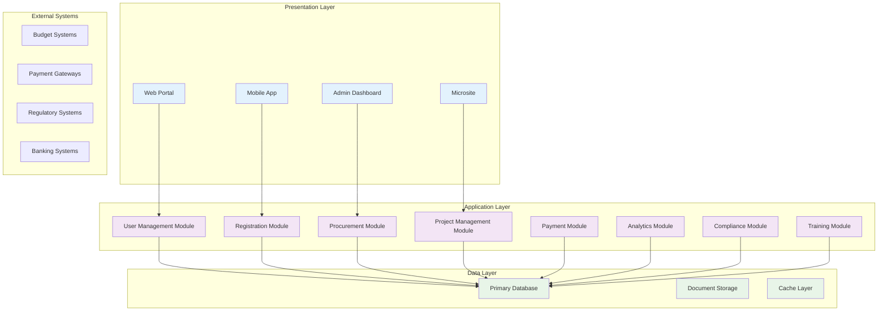
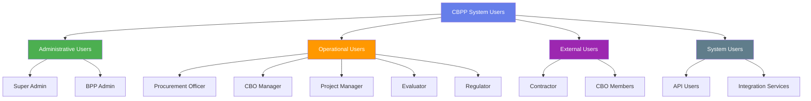
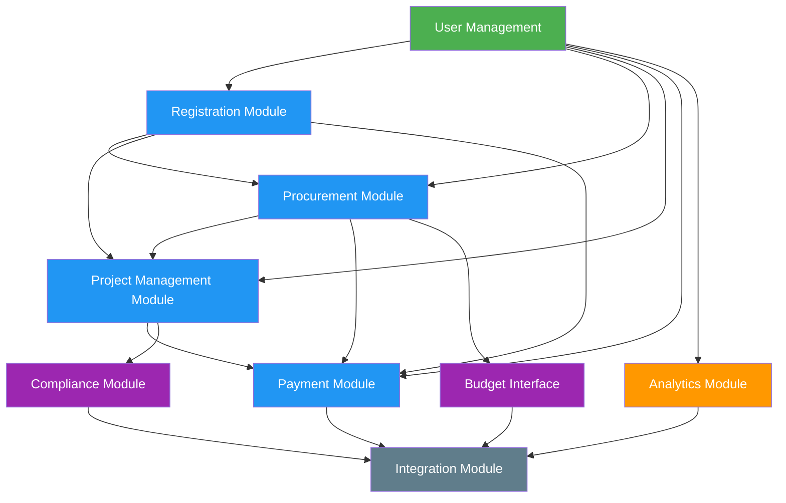
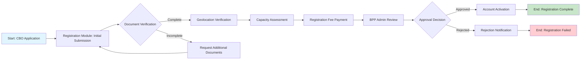
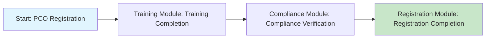
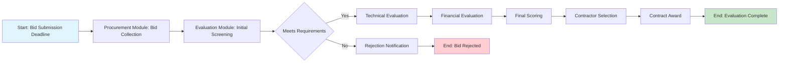
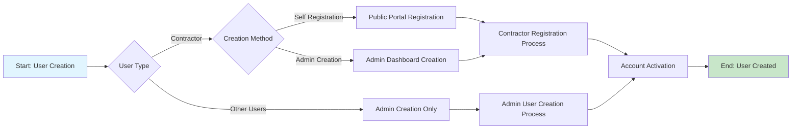
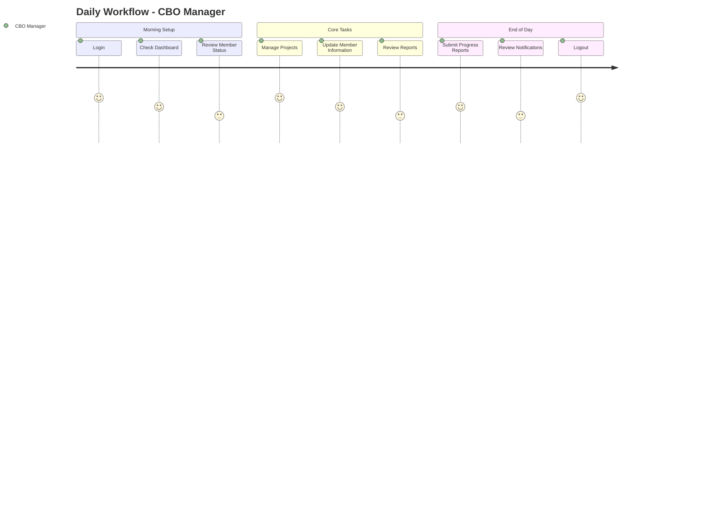
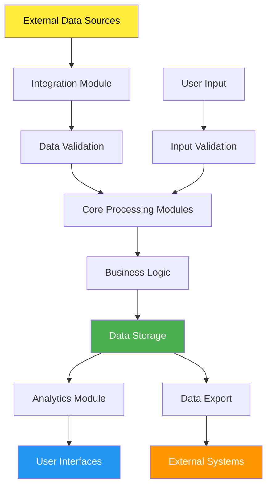

```mermaid
flowchart LR
    A[Start: Contractor Registration] --> B{Registration Method}
    B -->|Self Registration| C[Public Signup Portal]
    B -->|Admin Creation| D[Admin Dashboard]
    
    C --> E[Personal Information Collection]
    D --> E
    
    E --> F[Company Information Collection]
    F --> G[Business Registration Details]
    G --> H[Financial Information]
    H --> I[Tax Compliance Information]
    I --> J[Document Upload]
    J --> K[Location Information]
    K --> L[CBO Association]
    
    L --> M{Document Verification}
    M -->|Complete| N[BVN Verification]
    M -->|Incomplete| O[Request Additional Documents]
    O --> J
    
    N --> P[Bank Details Verification]
    P --> Q[Registration Fee Payment]
    Q --> R[BPP Admin Review]
    R --> S{Approval Decision}
    S -->|Approved| T[Account Activation]
    S -->|Rejected| U[Rejection Notification]
    T --> V[End: Registration Complete]
    U --> W[End: Registration Failed]
    
    style A fill:#e1f5fe
    style V fill:#c8e6c9
    style W fill:#ffcdd2
```

# System Modules and Processes Summary

## Document Information
- **System Name:** Community-Based Procurement Platform (CBPP)
- **System Version:** 1.0
- **Document Version:** 1.0
- **Date:** December 2024
- **Prepared By:** ASOS Consulting Development Team
- **Reviewed By:** [Reviewer Name, Role]
- **Approved By:** [Approver Name, Role]
- **Document Type:** System Overview
- **Classification:** Internal

## Document History
| Version | Date | Author | Changes | Reviewer |
|---------|------|--------|---------|----------|
| 1.0 | December 2024 | ASOS Consulting | Initial version | [Reviewer] |

---

## 1. Executive Summary

### 1.1 System Overview
The Community-Based Procurement Platform (CBPP) is a comprehensive digital ecosystem designed to manage end-to-end procurement processes for projects implemented at various government levels in Nigeria and across Africa. The platform facilitates registration, qualification, and training of Community-Based Organizations (CBOs) and Procurement Compliance Officers (PCOs), interfaces with budget systems, enables transparent procurement processes, and provides monitoring and reporting capabilities. The multi-tenant architecture allows for customization to meet the specific needs of different government entities while maintaining core features and compliance standards.

### 1.2 Key Statistics
| Metric | Value | Notes |
|--------|-------|-------|
| **Total Modules** | 15 | Core business and supporting modules |
| **Total Users** | 10,000+ | Estimated across all user types |
| **User Types** | 8 | Super Admin, BPP Admin, Procurement Officer, CBO Manager, Project Manager, Contractor, Regulator, Evaluator |
| **Business Processes** | 25+ | Core procurement and supporting processes |
| **Daily Transactions** | 5,000+ | Estimated daily volume |
| **System Uptime** | 99.9% | Target availability |

### 1.3 System Scope
- **Business Domain:** Government Procurement and Community Development
- **Geographic Coverage:** Nigeria (initially), expandable to other African countries
- **Integration Points:** 10+ external systems (budget, payment, regulatory, etc.)
- **Deployment Model:** Cloud-based multi-tenant architecture

---

## 2. System Architecture Overview

### 2.1 High-Level Architecture

### 2.2 Technology Stack Summary
| Layer | Technology | Purpose |
|-------|------------|---------|
| **Frontend** | React.js, TypeScript | User interface and experience |
| **Backend** | Node.js/Express.js, TypeScript | Business logic and APIs |
| **Database** | PostgreSQL, MongoDB | Data persistence and management |
| **Infrastructure** | Azure/AWS, Docker, Kubernetes | Hosting and deployment |
| **Integration** | Apache Camel, API Gateway | External system connectivity |

---

## 3. System Users and Roles

### 3.1 User Classification

### 3.2 User Roles Matrix
| Role | User Type | Access Level | Primary Functions | Module Access | User Count |
|------|-----------|--------------|-------------------|---------------|------------|
| **Super Admin** | Administrative | Full | System configuration, user management, role assumption | All modules | 5-10 |
| **BPP Admin** | Administrative | High | Platform oversight, configuration, analytics | All modules except role assumption | 20-50 |
| **Procurement Officer** | Operational | Medium | Procurement process management | Procurement, Budget, Payment modules | 100-200 |
| **CBO Manager** | Operational | Medium | CBO management, project oversight | CBO, Project, Member modules | 500-1000 |
| **Project Manager** | Operational | Medium | Project implementation, monitoring | Project, Payment, Reporting modules | 200-500 |
| **Contractor** | External | Limited | Tender participation, contract execution | Procurement, Payment, Training modules | 2000-5000 |
| **Evaluator** | Operational | Medium | Tender evaluation, scoring | Evaluation, Analytics modules | 50-100 |
| **Regulator** | Operational | High | Compliance monitoring, oversight | Compliance, Oversight, Reporting modules | 20-50 |

### 3.3 User Access Patterns
| User Type | Peak Usage Times | Common Activities | Access Channels |
|-----------|------------------|-------------------|-----------------|
| **Administrative Users** | 9 AM - 5 PM | System monitoring, configuration, user management | Web portal, admin dashboard |
| **Operational Users** | 8 AM - 6 PM | Daily operations, process management, reporting | Web portal, mobile app |
| **External Users** | 24/7 | Tender browsing, application submission, training | Web portal, mobile app, USSD |
| **System Users** | 24/7 | Automated processes, data synchronization | API, batch jobs |

### 3.4 User Management Module

#### 3.4.1 User Creation Rules
- **Contractors:** Can self-register through public signup portal OR be created by Super Admin, BPP Admin, or PCO
- **All Other Users:** Can only be created by Super Admin, BPP Admin, or PCO (no self-registration)

#### 3.4.2 Contractor Registration Process

##### 3.4.2.1 Self-Registration Workflow
1. **Public Signup Portal Access**
   - Contractors access signup form via public microsite
   - Form collects required contractor information
   - BVN verification initiated during registration

2. **Account Creation with Pending Status**
   - System creates contractor account with "pending_approval" status
   - Contractor receives confirmation email
   - Account is immediately accessible for login

3. **Limited Dashboard Access**
   - Pending contractors can login and access limited dashboard
   - Dashboard shows approval status and progress
   - Access to training, notifications, and basic profile management
   - Procurement features restricted until approval

4. **Admin Review Process**
   - Super Admin, BPP Admin, or PCO reviews contractor applications
   - Review includes document verification and background checks
   - Admin can approve, reject, or request additional information

5. **Approval and Full Access**
   - Upon approval, contractor status changes to "approved"
   - Contractor gains full access to all features
   - Notification sent to contractor about approval

##### 3.4.2.2 Admin-Created Contractor Workflow
1. **Admin Creation**
   - Super Admin, BPP Admin, or PCO creates contractor account
   - Account created with "pending_verification" status
   - Contractor receives invitation email with login credentials

2. **Document Verification**
   - Contractor uploads required documents
   - System validates document authenticity
   - BVN and other verifications completed

3. **Account Activation**
   - Upon successful verification, account status changes to "approved"
   - Contractor gains full platform access

#### 3.4.3 Account Status Types
- **pending_approval:** Self-registered contractor awaiting admin review
- **pending_verification:** Admin-created contractor awaiting document verification
- **approved:** Fully verified and approved contractor
- **rejected:** Application rejected by admin
- **suspended:** Temporarily suspended account

#### 3.4.4 User Onboarding Process

##### 3.4.4.1 Contractor Onboarding
1. **Registration Phase**
   - Self-registration or admin creation
   - Basic information collection
   - Initial verification setup

2. **Verification Phase**
   - Document upload and verification
   - BVN verification
   - Background checks (if required)

3. **Approval Phase**
   - Admin review and decision
   - Status update and notification
   - Feature access granted based on approval

4. **Training Phase**
   - Platform orientation
   - Role-specific training modules
   - Assessment completion

##### 3.4.4.2 Other User Onboarding
1. **Account Creation**
   - Admin creates account
   - Role assignment
   - Initial password setup

2. **Profile Completion**
   - User completes profile information
   - Required document upload
   - Verification processes

3. **Access Provisioning**
   - Role-based permissions assigned
   - Feature access granted
   - Training materials provided

### 3.5 Contractor Management Module

#### 3.5.1 Contractor Registration and Verification

##### 3.5.1.1 Self-Registration Process
1. **Public Portal Access**
   - Contractors access signup form at `/signup`
   - Form validation and data collection
   - Real-time field validation

2. **Account Creation**
   - System creates contractor account with "pending_approval" status
   - Email confirmation sent
   - Login credentials provided

3. **Limited Access Provisioning**
   - Contractor can login immediately
   - Access to limited dashboard features
   - Training and notification access
   - Profile management capabilities

4. **Admin Review Queue**
   - Application appears in admin review queue
   - Notification sent to relevant admins
   - Review timeline tracking

##### 3.5.1.2 Admin Review and Approval
1. **Application Review**
   - Admin reviews contractor information
   - Document verification
   - Background checks
   - Compliance validation

2. **Decision Process**
   - Approve: Grant full access
   - Reject: Provide reason and next steps
   - Request More Info: Send notification to contractor

3. **Status Update**
   - Update contractor account status
   - Send notification to contractor
   - Update access permissions

##### 3.5.1.3 Post-Approval Management
1. **Full Access Provisioning**
   - Procurement feature access
   - Contract management capabilities
   - Reporting and analytics access
   - Payment processing features

2. **Ongoing Monitoring**
   - Performance tracking
   - Compliance monitoring
   - Regular status reviews

#### 3.5.2 Contractor Profile Management

##### 3.5.2.1 Status-Dependent Access
- **Pending Contractors:** Can update basic information and upload documents
- **Approved Contractors:** Full profile management capabilities
- **BVN-Verified Fields:** Read-only for all contractors

##### 3.5.2.2 Document Management
- Document upload and storage
- Version control and tracking
- Expiration date monitoring
- Automated renewal reminders

### 3.6 Procurement Management Module

#### 3.6.1 Tender Management

##### 3.6.1.1 Tender Access Control
- **Approved Contractors Only:** Can view and apply for tenders
- **Pending Contractors:** See preview content and approval requirements
- **Other Users:** Role-based access as defined

##### 3.6.1.2 Tender Application Process
1. **Eligibility Check**
   - Verify contractor approval status
   - Check geographic eligibility
   - Validate capacity requirements

2. **Application Submission**
   - Online application form
   - Document upload requirements
   - Technical and financial proposals

3. **Application Tracking**
   - Status updates and notifications
   - Timeline management
   - Communication with procurement officers

### 3.7 Payment Management Module

#### 3.7.1 Platform Payments
- **All Contractors:** Can access platform payment features
- Payment processing and tracking
- Receipt generation
- Payment history management

#### 3.7.2 Contract Payments
- **Approved Contractors Only:** Can access contract payment features
- Payment schedule management
- Payment request submission
- Certificate generation

### 3.8 Reporting and Analytics Module

#### 3.8.1 Contractor Reports
- **Approved Contractors Only:** Can access reporting features
- Procurement activity reports
- Contract performance reports
- Financial reports

#### 3.8.2 Admin Reports
- Contractor approval status reports
- Registration analytics
- Verification timeline reports

### 3.9 Training and Development Module

#### 3.9.1 Training Access
- **All Contractors:** Can access training materials regardless of approval status
- Course catalog and enrollment
- Progress tracking
- Assessment completion

#### 3.9.2 Role-Specific Training
- Contractor-specific training modules
- Approval process training for pending contractors
- Platform usage training for approved contractors

### 3.10 Notification Management Module

#### 3.10.1 Notification Types
- **Approval Status Notifications:** For pending contractors
- **Tender Notifications:** For approved contractors
- **Payment Notifications:** For all contractors
- **System Notifications:** For all users

#### 3.10.2 Notification Delivery
- Real-time in-app notifications
- Email notifications
- SMS notifications (optional)
- Notification preferences management

### 3.11 Process Integration Matrix

#### 3.11.1 Contractor Registration Integration

##### 3.11.1.1 Self-Registration Flow
1. **Public Portal** → **User Management** → **Contractor Management**
2. **Account Creation** → **Notification System** → **Admin Dashboard**
3. **Admin Review** → **Status Update** → **Access Control**
4. **Approval** → **Feature Provisioning** → **Training Access**

##### 3.11.1.2 Admin-Created Flow
1. **Admin Dashboard** → **User Management** → **Contractor Creation**
2. **Invitation** → **Notification System** → **Contractor Portal**
3. **Document Upload** → **Verification System** → **Status Update**
4. **Approval** → **Feature Provisioning** → **Full Access**

#### 3.11.2 Procurement Integration

##### 3.11.2.1 Tender Access Control
1. **Login** → **Status Check** → **Feature Access**
2. **Approved Contractors** → **Full Tender Access**
3. **Pending Contractors** → **Preview Content Only**

##### 3.11.2.2 Application Process
1. **Eligibility Check** → **Status Validation** → **Application Access**
2. **Application Submission** → **Document Management** → **Review Queue**
3. **Admin Review** → **Decision Process** → **Notification System**

#### 3.11.3 Payment Integration

##### 3.11.3.1 Platform Payments
1. **All Contractors** → **Payment Access** → **Transaction Processing**
2. **Payment History** → **Receipt Generation** → **Notification System**

##### 3.11.3.2 Contract Payments
1. **Approved Contractors Only** → **Contract Payment Access**
2. **Payment Requests** → **Approval Workflow** → **Disbursement**
3. **Payment Tracking** → **Certificate Generation** → **Reporting System**

#### 3.11.4 Reporting Integration

##### 3.11.4.1 Contractor Reports
1. **Approved Contractors Only** → **Report Access** → **Data Analytics**
2. **Report Generation** → **Export Functionality** → **Document Management**

##### 3.11.4.2 Admin Reports
1. **Admin Dashboard** → **Registration Analytics** → **Status Reports**
2. **Approval Metrics** → **Timeline Analysis** → **Performance Tracking**

#### 3.11.5 Training Integration

##### 3.11.5.1 Training Access
1. **All Contractors** → **Training Portal** → **Course Catalog**
2. **Enrollment** → **Progress Tracking** → **Assessment System**
3. **Completion** → **Certificate Generation** → **Notification System**

#### 3.11.6 Notification Integration

##### 3.11.6.1 Status-Based Notifications
1. **Registration** → **Confirmation Email** → **Welcome Message**
2. **Approval Status** → **Status Update** → **Feature Access Notification**
3. **Admin Review** → **Review Notification** → **Decision Communication**

##### 3.11.6.2 Feature Notifications
1. **Tender Opportunities** → **Approved Contractors Only** → **Application Reminders**
2. **Payment Updates** → **All Contractors** → **Transaction Notifications**
3. **Training Updates** → **All Contractors** → **Course Notifications**

---

## 4. System Modules

### 4.1 Module Overview
| Module ID | Module Name | Purpose | Status | Dependencies | Owner |
|-----------|-------------|---------|--------|--------------|-------|
| MOD-001 | User Management | Authentication, authorization, user lifecycle | Active | None | System Team |
| MOD-002 | Registration | CBO, PCO, Contractor registration | Active | User Management | Business Team |
| MOD-003 | Procurement | Tender management, evaluation, award | Active | Registration, Budget | Procurement Team |
| MOD-004 | Project Management | Project tracking, implementation | Active | Procurement | Project Team |
| MOD-005 | Payment & Financial | Payment processing, financial management | Active | Project Management | Finance Team |
| MOD-006 | Budget Interface | Budget integration, allocation | Active | External Systems | Finance Team |
| MOD-007 | Analytics & Reporting | Business intelligence, reporting | Active | All modules | Analytics Team |
| MOD-008 | Compliance | Regulatory compliance, audit | Active | All modules | Compliance Team |
| MOD-009 | Training | E-learning, certification | Active | Registration | Training Team |
| MOD-010 | Microsite | Public information portal | Active | None | Marketing Team |
| MOD-011 | Multi-Tenancy | Tenant management, isolation | Active | All modules | System Team |
| MOD-012 | Integration | External system connectivity | Active | All modules | Integration Team |
| MOD-013 | Notification | System notifications, alerts | Active | All modules | System Team |
| MOD-014 | Security | Security framework, monitoring | Active | All modules | Security Team |
| MOD-015 | Monitoring | System health, performance | Active | All modules | DevOps Team |

### 4.2 Core Business Modules

#### 4.2.1 Registration Module
- **Module ID:** MOD-002
- **Purpose:** Manages registration and onboarding of CBOs, PCOs, and Contractors
- **Key Features:**
  - Digital onboarding process with tiered registration levels
  - Document verification system for credentials
  - Geolocation tagging for operational location verification
  - Capacity assessment tools for procurement capability
  - Registration fee processing with multiple payment options
  - Approval workflow involving BPP and LGA authorities
- **Primary Users:** CBOs, PCOs, Contractors, BPP Admins
- **Business Value:** Ensures qualified participants in procurement processes
- **Integration Points:** Payment Gateway, Document Storage, Geolocation Services
- **Performance Metrics:**
  - Registration completion rate: 85%
  - Average registration time: 3-5 days
  - Document verification accuracy: 95%

#### 4.2.2 Procurement Module
- **Module ID:** MOD-003
- **Purpose:** Manages the complete procurement lifecycle from planning to contract award
- **Key Features:**
  - Digital procurement plan creation and submission
  - E-tendering portal with secure bid submission
  - Tender document generation and management
  - Bid evaluation criteria configuration
  - Transparent selection process with audit trails
  - Contract award publication
  - Grievance redressal mechanisms
- **Primary Users:** Procurement Officers, Contractors, Evaluators, BPP Admins
- **Business Value:** Ensures transparent and efficient procurement processes
- **Integration Points:** Budget Interface, Payment Module, Notification System
- **Data Flow:** Procurement plans → Tender creation → Bid submission → Evaluation → Award

#### 4.2.3 Project Management Module
- **Module ID:** MOD-004
- **Purpose:** Tracks project implementation, progress, and outcomes
- **Key Features:**
  - Real-time progress reporting with mobile capabilities
  - Geo-tagged verification of physical implementation
  - Quality assurance checklists
  - Issue tracking and resolution system
  - Community feedback integration
  - Milestone tracking with automated notifications
- **Primary Users:** Project Managers, CBO Managers, Contractors, Regulators
- **Business Value:** Ensures successful project delivery and community impact
- **Integration Points:** Payment Module, Compliance Module, Notification System
- **Performance Metrics:**
  - Project completion rate: 90%
  - Average project duration: 6-12 months
  - Community satisfaction score: 4.2/5

#### 4.2.4 Payment & Financial Module
- **Module ID:** MOD-005
- **Purpose:** Manages all financial transactions and payment processing
- **Key Features:**
  - Milestone-based payment triggers
  - Multi-level approval workflows
  - Payment tracking with blockchain verification
  - Bank integration for direct disbursements
  - Transaction fee processing
  - Financial reporting and compliance monitoring
- **Primary Users:** Finance Teams, Project Managers, Contractors, Regulators
- **Business Value:** Ensures timely and secure financial transactions
- **Integration Points:** Banking Systems, Budget Interface, Compliance Module
- **Performance Metrics:**
  - Payment processing time: 2-3 business days
  - Payment accuracy rate: 99.5%
  - Fraud detection rate: 98%

### 4.3 Supporting Modules

#### 4.3.1 User Management Module
- **Purpose:** Authentication, authorization, user lifecycle management
- **Key Functions:**
  - User registration and onboarding
  - Role-based access control with fine-grained permissions
  - Multi-factor authentication for sensitive operations
  - Session management with appropriate timeouts
  - User profile management
  - Activity logging and audit trails
- **Users:** All system users
- **Critical Dependencies:** Security Module, Notification Module

#### 4.3.2 Analytics & Reporting Module
- **Purpose:** Business intelligence and operational reporting
- **Key Functions:**
  - Executive dashboards for different stakeholders
  - Geographic information system (GIS) integration
  - Performance metrics visualization
  - Trend analysis tools
  - Comparative reporting across regions
  - Impact assessment frameworks
- **Users:** Management, operations staff, business analysts
- **Data Sources:** All modules and external systems

#### 4.3.3 Integration Module
- **Purpose:** External system connectivity and data exchange
- **Key Functions:**
  - API management with tenant-aware routing
  - Data transformation and validation
  - Error handling and retry logic
  - Integration monitoring and health checks
  - Manual data import/export capabilities
  - Real-time and batch processing
- **Users:** System administrators, integration specialists
- **External Connections:** Budget systems, payment gateways, regulatory systems, banking systems

### 4.4 Module Dependencies Map

---

## 5. Business Processes

### 5.1 Process Overview
| Process ID | Process Name | Type | Frequency | Modules Involved | Primary Users |
|------------|--------------|------|-----------|------------------|---------------|
| BP-001 | CBO Registration Process | Core | On-demand | Registration, User Management | CBOs, BPP Admins |
| BP-002 | Contractor Registration Process | Core | On-demand | Registration, User Management | Contractors, BPP Admins |
| BP-003 | PCO Registration & Certification | Core | On-demand | Registration, Training | PCOs, BPP Admins |
| BP-004 | Procurement Planning Process | Core | Monthly/Quarterly | Procurement, Budget Interface | Procurement Officers |
| BP-005 | Tender Publication Process | Core | Weekly | Procurement, Notification | Procurement Officers, BPP Admins |
| BP-006 | Bid Submission Process | Core | Daily | Procurement, Registration | Contractors |
| BP-007 | Tender Evaluation Process | Core | Weekly | Procurement, Analytics | Evaluators, Procurement Officers |
| BP-008 | Contract Award Process | Core | Weekly | Procurement, Project Management | Procurement Officers, BPP Admins |
| BP-009 | Project Implementation Process | Core | Daily | Project Management, Payment | Project Managers, Contractors |
| BP-010 | Payment Processing Process | Core | Daily | Payment, Project Management | Finance Teams, Project Managers |
| BP-011 | Compliance Monitoring Process | Support | Daily | Compliance, All modules | Regulators, BPP Admins |
| BP-012 | Training & Certification Process | Support | Monthly | Training, Registration | PCOs, CBOs, Contractors |
| BP-013 | Reporting & Analytics Process | Support | Weekly/Monthly | Analytics, All modules | All user types |
| BP-014 | Budget Integration Process | Support | Daily | Budget Interface, Integration | Finance Teams, System Admins |
| BP-015 | User Onboarding Process | Support | Daily | User Management, Training | All new users |

### 5.2 Core Business Processes

#### 5.2.1 CBO Registration Process
- **Process ID:** BP-001
- **Description:** Complete registration and verification of Community-Based Organizations
- **Business Objective:** Ensure qualified CBOs can participate in procurement processes
- **Frequency:** On-demand as CBOs apply
- **Trigger:** CBO submits registration application

**Process Flow:**

**Stakeholders:**
- **Process Owner:** BPP Administration
- **Primary Users:** CBO Representatives, BPP Admins
- **Approvers:** BPP Admins, LGA Authorities
- **Beneficiaries:** CBOs, Local Communities

**Key Metrics:**
- **Processing Time:** 3-5 business days
- **Success Rate:** 85%
- **Volume:** 100-200 registrations per month
- **Error Rate:** 5%

#### 5.2.2 Contractor Registration Process
- **Process ID:** BP-002
- **Description:** Complete registration and verification of contractors with comprehensive business information
- **Business Objective:** Ensure qualified contractors can participate in procurement processes
- **Frequency:** On-demand as contractors apply or are created by admins
- **Trigger:** Contractor self-registration OR Admin creates contractor account

**Process Flow:**

**Stakeholders:**
- **Process Owner:** BPP Administration
- **Primary Users:** Contractors, BPP Admins, Super Admins
- **Approvers:** BPP Admins, Super Admins
- **Beneficiaries:** Contractors, Local Communities

**Key Metrics:**
- **Processing Time:** 5-7 business days
- **Success Rate:** 80%
- **Volume:** 200-500 registrations per month
- **Error Rate:** 8%

**Required Information:**
- **Personal Information:** Name, BVN, NIN, Contact details, Gender, Date of birth
- **Company Information:** Company name, Registration number, Type (Limited/Partnership/Sole), Category
- **Business Registration:** Certificate number, Issue date, Expiry date, Category (Class A/B/C)
- **Financial Information:** Bank name, Account number, Account name, Annual turnover
- **Tax Compliance:** TIN, Tax clearance certificate, Compliance status
- **Documents:** Company registration, Tax clearance, Insurance certificate, Other relevant documents
- **Location Information:** State, LGA, Address
- **CBO Association:** Multiple CBO associations allowed

**Verification Process:**
1. **Document Verification:** Manual review of uploaded documents
2. **BVN Verification:** Automated verification through banking system
3. **Bank Details Verification:** Account verification and validation
4. **Tax Compliance Check:** Verification with FIRS systems
5. **Business Registration Verification:** Validation with CAC systems

#### 5.2.3 PCO Registration & Certification
- **Process ID:** BP-003
- **Description:** Registration and certification of Procurement Compliance Officers
- **Business Objective:** Ensure qualified PCOs can perform their duties
- **Frequency:** On-demand as PCOs apply
- **Trigger:** PCO submits registration application

**Process Flow:**

**Stakeholders:**
- **Process Owner:** BPP Administration
- **Primary Users:** PCOs, BPP Admins
- **Approvers:** BPP Admins, Super Admins
- **Beneficiaries:** PCOs, Local Communities

**Key Metrics:**
- **Processing Time:** 1-2 months
- **Success Rate:** 90%
- **Volume:** 100-200 registrations per year
- **Error Rate:** 5%

**Required Information:**
- **Training Completion:** Completion of required training courses
- **Compliance Verification:** Verification of compliance with procurement regulations

#### 5.2.4 Procurement Planning Process
- **Process ID:** BP-004
- **Description:** Planning and approval of procurement activities
- **Business Objective:** Ensure proper planning and approval of procurement activities
- **Frequency:** Monthly/Quarterly planning cycles

**Module Interaction:**
| Step | Module | User Role | Action | Duration |
|------|--------|-----------|--------|----------|
| 1 | Budget Interface | Procurement Officer | Review budget allocations | 1-2 days |
| 2 | Procurement | Procurement Officer | Create procurement plan | 2-3 days |
| 3 | Procurement | BPP Admin | Review and approve plan | 1-2 days |
| 4 | Notification | System | Notify stakeholders | Immediate |
| 5 | Analytics | System | Update planning metrics | Daily |

**Integration Points:**
- **Budget Systems:** API integration for budget data
- **Notification System:** Automated stakeholder notifications

#### 5.2.5 Tender Publication Process
- **Process ID:** BP-005
- **Description:** Publication of procurement tenders
- **Business Objective:** Ensure transparency and competition in procurement processes
- **Frequency:** Weekly publication cycles

**Module Interaction:**
| Step | Module | User Role | Action | Duration |
|------|--------|-----------|--------|----------|
| 1 | Procurement | Procurement Officer | Create tender | 1-2 days |
| 2 | Notification | System | Notify stakeholders | Immediate |
| 3 | Analytics | System | Update tender metrics | Daily |

**Integration Points:**
- **Notification System:** Automated stakeholder notifications

#### 5.2.6 Bid Submission Process
- **Process ID:** BP-006
- **Description:** Submission of bids for procurement tenders
- **Business Objective:** Ensure fair and transparent bidding process
- **Frequency:** Daily submission cycles

**Module Interaction:**
| Step | Module | User Role | Action | Duration |
|------|--------|-----------|--------|----------|
| 1 | Procurement | Contractor | Submit bid | 1-2 days |
| 2 | Notification | System | Notify stakeholders | Immediate |
| 3 | Analytics | System | Update bid metrics | Daily |

**Integration Points:**
- **Notification System:** Automated stakeholder notifications

#### 5.2.7 Tender Evaluation Process
- **Process ID:** BP-007
- **Description:** Evaluation of submitted bids and selection of contractors
- **Business Objective:** Ensure fair and transparent contractor selection
- **Frequency:** Weekly evaluation cycles

**Process Flow:**

### 5.3 Supporting Processes

#### 5.3.1 User Onboarding Process
- **Purpose:** New user account creation and initial access setup
- **Modules Involved:** User Management, Training, Notification
- **Users:** HR, IT Administration, New Users
- **Duration:** 1-2 business days
- **Automation Level:** Semi-automated

**User Creation Rules:**
- **Contractors:** Can self-register through public portal OR be created by Super Admin/BPP Admin
- **All Other Users:** Created exclusively by Super Admin or BPP Admin
- **Admin Users:** Created only by Super Admin
- **User Types:** Super Admin, BPP Admin, Procurement Officer, CBO Manager, Project Manager, Contractor, Regulator, Evaluator

**Process Flow:**

#### 5.3.2 Compliance Monitoring Process
- **Purpose:** Continuous monitoring of regulatory compliance across all activities
- **Modules Involved:** Compliance, All business modules
- **Users:** Regulators, BPP Admins, Super Admins
- **Frequency:** Daily monitoring with weekly reports
- **Automation Level:** Highly automated with manual review

### 5.4 Process Integration Matrix
| Process | Modules Used | External Systems | User Roles | Dependencies |
|---------|--------------|------------------|------------|--------------|
| BP-001 | Registration, User Management, Payment | Banking Systems | CBOs, BPP Admins | Document verification |
| BP-002 | Registration, User Management, Payment, Verification | Banking Systems, FIRS, CAC | Contractors, BPP Admins, Super Admins | Document verification, BVN verification |
| BP-003 | Registration, Training, Compliance | Training Systems | PCOs, BPP Admins | Training completion |
| BP-004 | Procurement, Budget Interface, Analytics | Budget Systems | Procurement Officers, BPP Admins | Budget availability |
| BP-005 | Procurement, Notification, Analytics | Notification Systems | Procurement Officers, BPP Admins | Tender creation |
| BP-006 | Procurement, Registration, Notification | Notification Systems | Contractors | Bid submission |
| BP-007 | Procurement, Analytics, Notification | None | Evaluators, Procurement Officers | Bid submissions |
| BP-010 | Payment, Project Management, Compliance | Banking Systems | Finance Teams, Project Managers | Project milestones |
| BP-011 | Compliance, All modules | Regulatory Systems | Regulators, BPP Admins | All business activities |

---

## 6. User Journey Mapping

### 6.1 Typical User Journeys

#### 6.1.1 CBO Manager Daily Workflow

#### 6.1.2 Contractor Procurement Journey
| Step | Module | User Action | System Response | Next Module |
|------|--------|-------------|-----------------|-------------|
| 1 | Registration | Complete registration | Account activation | Procurement |
| 2 | Procurement | Browse available tenders | Display filtered results | Procurement |
| 3 | Procurement | Submit bid | Confirmation and tracking | Notification |
| 4 | Procurement | Track evaluation status | Status updates | Analytics |
| 5 | Project Management | Accept contract award | Project setup | Payment |

### 6.2 User Experience Metrics
| User Type | Login Frequency | Session Duration | Most Used Modules | Satisfaction Score |
|-----------|----------------|------------------|-------------------|-------------------|
| CBO Manager | Daily | 2-4 hours | Project Management, Member Management | 4.3/5 |
| Contractor | 3-4 times/week | 1-2 hours | Procurement, Payment | 4.1/5 |
| Procurement Officer | Daily | 4-6 hours | Procurement, Analytics | 4.4/5 |
| BPP Admin | Daily | 6-8 hours | Analytics, Configuration | 4.5/5 |

---

## 7. Data Flow and Integration

### 7.1 System Data Flow

### 7.2 Integration Summary
| Integration Type | External System | Data Direction | Frequency | Module Responsible |
|------------------|-----------------|----------------|-----------|-------------------|
| API | Budget Systems | In/Out | Real-time | Budget Interface |
| API | Payment Gateways | Out | Real-time | Payment Module |
| API | Banking Systems | Out | Real-time | Payment Module |
| API | Regulatory Systems | In/Out | Daily | Compliance Module |
| File Import | Document Systems | In | Batch | Registration Module |
| API | Geolocation Services | In | Real-time | Registration Module |

### 7.3 Data Governance
| Data Type | Owner | Classification | Retention Policy | Access Control |
|-----------|-------|----------------|------------------|----------------|
| User Registration Data | BPP | Confidential | 7 years | Role-based access |
| Procurement Data | BPP | Internal | 10 years | Role-based access |
| Financial Data | BPP | Confidential | 10 years | Finance team only |
| Compliance Data | Regulators | Confidential | 15 years | Regulator access |
| Analytics Data | BPP | Internal | 5 years | Management access |

---

## 8. Performance and Monitoring

### 8.1 System Performance Metrics
| Metric | Current Value | Target | Trend | Monitoring Tool |
|--------|---------------|--------|-------|-----------------|
| **Response Time** | 2.5s | <3s | ↓ | Application Performance Monitoring |
| **Throughput** | 1000 req/min | 1500 req/min | ↑ | Load Testing Tools |
| **Availability** | 99.8% | 99.9% | → | Infrastructure Monitoring |
| **Error Rate** | 0.5% | <1% | ↓ | Error Tracking |

### 8.2 Module Performance
| Module | Users | Transactions/Day | Response Time | Error Rate | Resource Usage |
|--------|-------|------------------|---------------|------------|----------------|
| Registration | 500 | 200 | 1.5s | 0.3% | Low |
| Procurement | 1000 | 5000 | 2.0s | 0.7% | Medium |
| Payment | 200 | 1000 | 3.0s | 0.2% | High |
| Analytics | 100 | 10000 | 4.0s | 1.0% | High |

### 8.3 User Activity Metrics
| User Type | Active Users | Peak Concurrent | Average Session | Most Used Feature |
|-----------|--------------|-----------------|-----------------|-------------------|
| CBO Manager | 800 | 200 | 2.5 hours | Project Management |
| Contractor | 3000 | 500 | 1.5 hours | Tender Browsing |
| Procurement Officer | 150 | 50 | 4.0 hours | Tender Management |
| BPP Admin | 30 | 10 | 6.0 hours | Analytics Dashboard |

---

## 9. Security and Compliance

### 9.1 Security Framework
| Security Layer | Implementation | Modules Covered | Compliance Standard |
|----------------|----------------|------------------|-------------------|
| **Authentication** | OAuth 2.0, MFA | All modules | ISO 27001 |
| **Authorization** | RBAC with fine-grained permissions | All modules | ISO 27001 |
| **Data Encryption** | AES-256 at rest, TLS 1.3 in transit | All modules | ISO 27001 |
| **Audit Logging** | Comprehensive audit trails | All modules | ISO 27001 |

### 9.2 User Access Security
| User Type | Authentication Method | Access Restrictions | Session Timeout | Audit Level |
|-----------|----------------------|-------------------|-----------------|-------------|
| Internal Users | MFA, Biometric | Role-based restrictions | 8 hours | High |
| External Users | MFA | Limited access | 4 hours | Medium |
| System Users | API Keys, Certificates | Programmatic access | 24 hours | High |

### 9.3 Compliance Requirements
| Requirement | Applicable Modules | Implementation | Audit Frequency |
|-------------|-------------------|----------------|-----------------|
| Public Procurement Act 2007 | All modules | Built into business logic | Quarterly |
| Data Protection | All modules | Encryption, access controls | Annually |
| Financial Regulations | Payment, Budget modules | Audit trails, reporting | Monthly |
| Anti-Money Laundering | Payment, Registration modules | KYC procedures, monitoring | Quarterly |

---

## 10. Maintenance and Support

### 10.1 Module Maintenance Schedule
| Module | Maintenance Type | Frequency | Downtime | Responsible Team |
|--------|------------------|-----------|----------|------------------|
| User Management | Security patches | Weekly | 30 minutes | Security Team |
| Payment Module | Feature updates | Monthly | 2 hours | Finance Team |
| Analytics Module | Performance optimization | Quarterly | 4 hours | Analytics Team |
| Integration Module | API updates | As needed | 1 hour | Integration Team |

### 10.2 Support Structure
| Support Level | Response Time | Availability | Contact Method | Escalation Path |
|---------------|---------------|--------------|----------------|-----------------|
| **Level 1** | 2 hours | 24/7 | Helpdesk, Email | Level 2 |
| **Level 2** | 4 hours | Business hours | Phone, Chat | Level 3 |
| **Level 3** | 8 hours | Business hours | Direct contact | Management |

### 10.3 Change Management
- **Change Request Process:** Formal change request with stakeholder approval
- **Release Schedule:** Monthly feature releases, weekly security updates
- **Testing Requirements:** Unit, integration, and user acceptance testing
- **Rollback Procedures:** Automated rollback capabilities for critical systems

---

## 11. Future Roadmap

### 11.1 Planned Enhancements
| Enhancement | Target Module | Expected Benefit | Timeline | Priority |
|-------------|---------------|------------------|----------|----------|
| AI-Powered Fraud Detection | Payment Module | Reduce fraud by 50% | Q2 2025 | High |
| Mobile App Enhancement | All modules | Improve user engagement | Q3 2025 | Medium |
| Blockchain Integration | Payment, Compliance modules | Enhanced transparency | Q4 2025 | High |
| Advanced Analytics | Analytics Module | Better decision support | Q1 2026 | Medium |

### 11.2 Technology Upgrades
| Component | Current Version | Target Version | Upgrade Reason | Impact |
|-----------|----------------|----------------|----------------|--------|
| React.js | 18.x | 19.x | Performance improvements | Low |
| Node.js | 18.x | 20.x | Security and performance | Medium |
| PostgreSQL | 14.x | 16.x | New features and performance | Medium |
| Docker | 24.x | 25.x | Security updates | Low |

### 11.3 Capacity Planning
| Resource | Current Capacity | Projected Need | Timeline | Action Required |
|----------|------------------|----------------|----------|-----------------|
| Database | 500GB | 2TB | Q2 2025 | Scale up storage |
| API Gateway | 1000 req/min | 3000 req/min | Q3 2025 | Load balancer upgrade |
| User Licenses | 10,000 | 25,000 | Q4 2025 | License expansion |

---

## 12. Appendices

### Appendix A: Module Detailed Specifications
- [Registration Module Technical Specification]
- [Procurement Module Technical Specification]
- [Payment Module Technical Specification]
- [Analytics Module Technical Specification]

### Appendix B: User Role Definitions
- [Super Admin Role Definition]
- [BPP Admin Role Definition]
- [CBO Manager Role Definition]
- [Contractor Role Definition]
- [Evaluator Role Definition]
- [Regulator Role Definition]

### Appendix C: Process Documentation
- [CBO Registration Process Guide]
- [Procurement Process Guide]
- [Payment Process Guide]
- [Compliance Process Guide]

### Appendix D: Integration Specifications
- [Budget System Integration Guide]
- [Payment Gateway Integration Guide]
- [Banking System Integration Guide]
- [Regulatory System Integration Guide]

### Appendix E: Emergency Procedures
- [System Emergency Response Plan]
- [Data Recovery Procedures]
- [Incident Management Process]
- [Business Continuity Plan]

### Appendix F: Contact Directory
| Role | Name | Email | Phone | Backup Contact |
|------|------|-------|-------|----------------|
| System Owner | [Name] | [Email] | [Phone] | [Backup] |
| Technical Lead | [Name] | [Email] | [Phone] | [Backup] |
| Business Lead | [Name] | [Email] | [Phone] | [Backup] |
| Security Officer | [Name] | [Email] | [Phone] | [Backup] |

---

## Document Approval

| Role | Name | Signature | Date |
|------|------|-----------|------|
| **System Owner** | [Name] | [Signature] | [Date] |
| **Technical Lead** | [Name] | [Signature] | [Date] |
| **Business Stakeholder** | [Name] | [Signature] | [Date] |
| **Security Officer** | [Name] | [Signature] | [Date] |

---

*This document contains confidential and proprietary information. Distribution is restricted to authorized personnel only.*

**Next Review Date:** March 2025
**Document Location:** [Repository/URL]
**Related Documents:** [List of related documentation] 