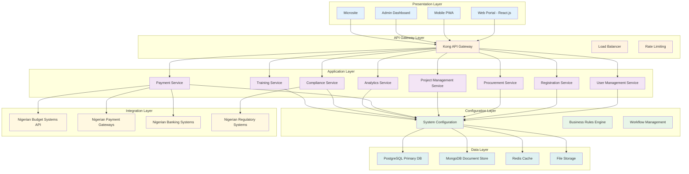
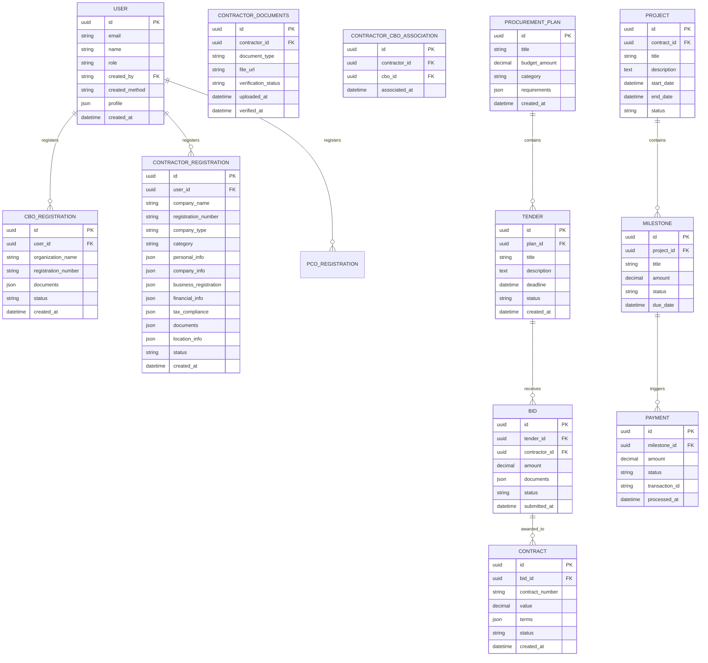

# Technical Specification Document: Community-Based Procurement Platform (CBPP) - Nigeria

## Document Information
- **Document Title:** Community-Based Procurement Platform (CBPP) Technical Specification - Nigeria
- **Version:** 2.0
- **Date:** December 2024
- **Author(s):** ASOS Consulting Development Team
- **Reviewers:** [Technical Lead, Solution Architect, Security Lead]
- **Approvers:** [Product Owner, Technical Lead, Security Lead]
- **Status:** Draft

## Document History
| Version | Date | Author | Changes | Reviewer |
|---------|------|--------|---------|----------|
| 1.0 | December 2024 | ASOS Consulting | Initial version | [Reviewer] |
| 2.0 | December 2024 | ASOS Consulting | Revised for Nigeria-specific implementation |

---

## 1. Executive Summary

### 1.1 Project Overview
The Community-Based Procurement Platform (CBPP) is a comprehensive digital ecosystem designed to manage end-to-end procurement processes for projects implemented at various government levels in Nigeria. The platform facilitates registration, qualification, and training of Community-Based Organizations (CBOs) and Procurement Compliance Officers (PCOs), interfaces with Nigerian budget systems, enables transparent procurement processes, and provides monitoring and reporting capabilities. The platform is specifically designed for the Nigerian Bureau of Public Procurement (BPP) to support President Bola Ahmed Tinubu's Renewed Hope Initiative and enable CBOs to participate in government procurement up to ₦50 million.

### 1.2 Scope and Limitations

#### 1.3.1 In Scope
- **Core Platform:** Complete CBPP system for Nigerian government procurement
- **User Management:** All 8 user types with role-based access control
- **Business Processes:** 15 core modules covering procurement lifecycle
- **Integration:** 10+ external system integrations
- **Security:** Comprehensive security framework and compliance
- **Deployment:** Cloud-based deployment for Nigerian government

#### 1.3.2 Out of Scope
- **Excluded:** Third-party system implementations, hardware procurement, physical infrastructure setup
- **Future Considerations:** Potential expansion to other government levels within Nigeria
- **Limitations:** Architecture optimized for Nigerian government requirements

### 1.3 Key Stakeholders
| Role | Name | Responsibility |
|------|------|---------------|
| Product Owner | [BPP Representative] | Business requirements and stakeholder management |
| Technical Lead | [ASOS Technical Lead] | Technical architecture and implementation oversight |
| Solution Architect | [ASOS Solution Architect] | System design and integration strategy |
| Security Lead | [ASOS Security Lead] | Security architecture and compliance |

---

## 2. Business Requirements Summary

### 2.1 Business Objectives
- Enable CBOs to participate in Nigerian government procurement up to ₦50 million
- Ensure transparent and accountable procurement processes in Nigeria
- Create economic opportunities for local communities across Nigeria
- Establish sustainable revenue model for platform operations
- Support President Bola Ahmed Tinubu's Renewed Hope Initiative
- Comply with Nigerian Public Procurement Act 2007 and related regulations

### 2.2 Success Criteria
- **User Adoption:** 10,000+ registered users across all user types within 12 months
- **Transaction Volume:** 5,000+ daily transactions with 99.9% uptime
- **Compliance:** 100% adherence to Nigerian Public Procurement Act 2007
- **Performance:** Page load time < 3 seconds, API response < 2 seconds
- **Accessibility:** WCAG 2.1 AA compliance with Nigerian language support

### 2.3 Constraints
- **Time Constraints:** 12-month development timeline with phased rollout
- **Budget Constraints:** Optimized for cost-effective cloud deployment
- **Resource Constraints:** Architecture optimized for Nigerian government requirements
- **Regulatory Constraints:** Must comply with Nigerian procurement laws, data protection regulations, and BPP guidelines

---

## 3. System Architecture

### 3.1 High-Level Architecture



### 3.2 Component Overview
| Component | Purpose | Technology | Dependencies |
|-----------|---------|------------|--------------|
| Web Portal | Main user interface | React.js, TypeScript | API Gateway |
| Mobile PWA | Mobile access | React.js, PWA features | API Gateway |
| API Gateway | Request routing and security | Kong/AWS API Gateway | Application Services |
| User Management | Authentication and authorization | Node.js, Express.js | PostgreSQL, Redis |
| Registration Service | CBO/PCO/Contractor registration | Node.js, Express.js | PostgreSQL, File Storage |
| Procurement Service | Tender management and evaluation | Node.js, Express.js | PostgreSQL, Analytics |
| Payment Service | Financial transactions | Node.js, Express.js | Nigerian Banking APIs, PostgreSQL |
| Configuration Layer | System configuration and business rules | Custom microservice | All services |

### 3.3 Integration Points
- **External APIs:** Nigerian budget systems, payment gateways, banking systems, regulatory systems
- **Third-party Services:** Authentication (OAuth 2.0), payment processing, document storage
- **Legacy Systems:** Nigerian government financial management systems, existing procurement systems

---

## 4. Technical Requirements

### 4.1 Functional Requirements

#### 4.1.1 Core Features
| Feature ID | Feature Name | Description | Priority | Acceptance Criteria |
|------------|--------------|-------------|----------|-------------------|
| F001 | CBO Registration | Digital onboarding with document verification | High | Complete registration in 3-5 days |
| F002 | Procurement Planning | Digital procurement plan creation and approval | High | Plan approval workflow with audit trail |
| F003 | E-Tendering | Secure bid submission and evaluation | High | Transparent evaluation with audit trails |
| F004 | Payment Processing | Milestone-based payment with blockchain verification | High | Payment processing in 2-3 business days |
| F005 | Project Tracking | Real-time progress reporting with geo-tagging | Medium | Mobile-enabled progress tracking |
| F006 | Analytics Dashboard | Executive dashboards with GIS integration | Medium | Real-time performance metrics |
| F007 | Training Platform | E-learning modules with certification | Medium | Complete training lifecycle management |
| F008 | Compliance Monitoring | Regulatory compliance with red flag detection | High | Automated compliance scoring |

#### 4.1.2 User Management
- **Authentication:** OAuth 2.0 with multi-factor authentication and biometric options
- **Authorization:** Role-based access control with fine-grained permissions for 8 user types
- **User Profiles:** Comprehensive profile management with document storage
- **User Creation Rules:**
  - **Contractors:** Can self-register through public signup portal OR be created by Super Admin, BPP Admin, or PCO
  - **All Other Users:** Can only be created by Super Admin, BPP Admin, or PCO (no self-registration)
- **User Types:** Super Admin, BPP Admin, Procurement Officer, CBO Manager, Project Manager, Contractor, Regulator, Evaluator

#### 4.1.3 Data Management
- **Data Entry:** Comprehensive validation with real-time feedback
- **Data Retrieval:** Advanced search with filtering and sorting capabilities
- **Data Export:** Multiple formats (CSV, Excel, PDF, XML) with scheduled exports

#### 4.1.4 Contractor Registration
- **Self-Registration Process**
  - Public signup portal accessible at `/signup`
  - Form validation and data collection
  - BVN verification during registration
  - Account creation with "pending_approval" status
  - Immediate login access with limited features
- **Admin Review Process**
  - Super Admin, BPP Admin, or PCO reviews applications
  - Document verification and background checks
  - Approval, rejection, or request for additional information
  - Status update and notification to contractor
- **Post-Approval Access**
  - Full feature access upon approval
  - Procurement capabilities enabled
  - Contract management features activated
- **Account Status Management**
  - **pending_approval:** Self-registered contractor awaiting admin review
  - **pending_verification:** Admin-created contractor awaiting document verification
  - **approved:** Fully verified and approved contractor
  - **rejected:** Application rejected by admin
  - **suspended:** Temporarily suspended account

### 4.2 Non-Functional Requirements

#### 4.2.1 Performance Requirements
- **Response Time:** Page load < 3 seconds, API response < 2 seconds
- **Throughput:** 1,500 requests/minute with auto-scaling
- **Concurrent Users:** 5,000+ concurrent users with load balancing
- **Data Volume:** Support for 10TB+ data with horizontal scaling

#### 4.2.2 Scalability Requirements
- **Horizontal Scaling:** Auto-scaling based on CPU and memory usage
- **Vertical Scaling:** Database sharding and read replicas
- **Load Distribution:** Multi-region deployment with CDN

#### 4.2.3 Availability Requirements
- **Uptime:** 99.9% availability with SLA guarantees
- **Recovery Time:** RTO < 4 hours, RPO < 1 hour
- **Disaster Recovery:** Multi-region backup with automated failover

#### 4.2.4 Security Requirements
- **Authentication:** OAuth 2.0, MFA, biometric authentication
- **Data Encryption:** AES-256 at rest, TLS 1.3 in transit
- **Access Control:** RBAC with role-based permissions
- **Compliance:** ISO 27001, Nigerian Public Procurement Act 2007, Data Protection

---

## 5. Technology Stack

### 5.1 Frontend Technologies
| Component | Technology | Version | Justification |
|-----------|------------|---------|---------------|
| Framework | React.js | 18.x | Component-based architecture, large ecosystem |
| State Management | Redux Toolkit | 1.9.x | Predictable state management, dev tools |
| UI Library | Material-UI | 5.x | Accessibility compliance, design system |
| Build Tool | Vite | 4.x | Fast development, optimized builds |
| PWA | Workbox | 7.x | Offline capabilities, mobile optimization |

### 5.2 Backend Technologies
| Component | Technology | Version | Justification |
|-----------|------------|---------|---------------|
| Runtime | Node.js | 18.x LTS | JavaScript ecosystem, performance |
| Framework | Express.js | 4.x | Lightweight, flexible, middleware support |
| ORM | Prisma | 4.x | Type-safe database access, migrations |
| API Style | REST | - | Standard, widely supported |
| Validation | Joi | 17.x | Schema validation, error handling |

### 5.3 Database Technologies
| Component | Technology | Version | Justification |
|-----------|------------|---------|---------------|
| Primary DB | PostgreSQL | 15.x | ACID compliance, JSON support |
| Document Store | MongoDB | 6.x | Flexible schema, document storage |
| Cache | Redis | 7.x | High performance, pub/sub capabilities |
| Search | Elasticsearch | 8.x | Full-text search, analytics |

### 5.4 Infrastructure & DevOps
| Component | Technology | Version | Justification |
|-----------|------------|---------|---------------|
| Cloud Provider | AWS/Azure | - | Enterprise-grade, compliance |
| Containerization | Docker | 24.x | Consistent environments |
| Orchestration | Kubernetes | 1.28.x | Auto-scaling, high availability |
| CI/CD | GitHub Actions | - | Integration with Git, automation |
| Monitoring | DataDog | - | Comprehensive monitoring, alerting |

---

## 6. Data Architecture

### 6.1 Data Model



### 6.2 Database Schema

#### 6.2.1 Core Tables
| Table Name | Purpose | Key Fields | Relationships |
|------------|---------|------------|---------------|
| users | User account information | id, email, role, created_by, created_method | One-to-many with registrations |
| cbo_registrations | CBO registration data | id, user_id, organization_name, status | Many-to-one with user |
| contractor_registrations | Contractor registration data | id, user_id, company_name, registration_number, status | Many-to-one with user |
| contractor_documents | Contractor document storage | id, contractor_id, document_type, verification_status | Many-to-one with contractor |
| contractor_cbo_association | Contractor-CBO relationships | id, contractor_id, cbo_id | Many-to-many between contractor and CBO |
| procurement_plans | Procurement planning | id, title, budget_amount | One-to-many with tenders |
| tenders | Tender management | id, plan_id, title, deadline, status | One-to-many with bids |
| contracts | Contract management | id, bid_id, contract_number, value | One-to-one with project |
| projects | Project tracking | id, contract_id, title, status | One-to-many with milestones |
| payments | Payment processing | id, milestone_id, amount, status | Many-to-one with milestone |

#### 6.2.2 Data Storage Strategy
- **Primary Data:** PostgreSQL for transactional data with ACID compliance
- **Analytics Data:** MongoDB for flexible reporting and analytics
- **File Storage:** AWS S3/Azure Blob Storage for documents and media
- **Backup Strategy:** Daily automated backups with 30-day retention

### 6.3 Data Flow
1. **User Registration:** User data → Validation → Profile creation
2. **Procurement Process:** Plan creation → Tender publication → Bid submission → Evaluation → Contract award
3. **Project Execution:** Contract → Project setup → Milestone tracking → Payment processing
4. **Analytics:** Data collection → Processing → Aggregation → Dashboard display

---

## 7. API Specification

### 7.1 API Design Principles
- **RESTful Design:** Standard REST conventions with resource-based URLs
- **Versioning Strategy:** URL versioning (/api/v1/, /api/v2/)
- **Error Handling:** Standardized error responses with HTTP status codes
- **Rate Limiting:** Rate limiting with configurable thresholds

### 7.2 Core Endpoints

#### 7.2.1 Authentication Endpoints
```
POST   /api/v1/auth/login
POST   /api/v1/auth/logout
POST   /api/v1/auth/refresh
POST   /api/v1/auth/mfa/verify
POST   /api/v1/auth/biometric/verify
```

#### 7.2.2 User Management Endpoints
```
GET    /api/v1/users
POST   /api/v1/users
GET    /api/v1/users/{id}
PUT    /api/v1/users/{id}
DELETE /api/v1/users/{id}
GET    /api/v1/users/{id}/profile
PUT    /api/v1/users/{id}/profile
POST   /api/v1/users/admin-create
GET    /api/v1/users/by-role/{role}
```

#### 7.2.3 Registration Endpoints
```
POST   /api/v1/registration/cbo
POST   /api/v1/registration/contractor
POST   /api/v1/registration/contractor/self
POST   /api/v1/registration/pco
GET    /api/v1/registration/{id}/status
PUT    /api/v1/registration/{id}/documents
POST   /api/v1/registration/contractor/{id}/documents
GET    /api/v1/registration/contractor/{id}/documents
PUT    /api/v1/registration/contractor/{id}/verification
```

#### 7.2.4 Procurement Endpoints
```
GET    /api/v1/procurement/plans
POST   /api/v1/procurement/plans
GET    /api/v1/procurement/tenders
POST   /api/v1/procurement/tenders
POST   /api/v1/procurement/tenders/{id}/bids
GET    /api/v1/procurement/tenders/{id}/bids
```

#### 7.2.5 Payment Endpoints
```
GET    /api/v1/payments
POST   /api/v1/payments
GET    /api/v1/payments/{id}
PUT    /api/v1/payments/{id}/status
GET    /api/v1/payments/transactions
```

### 7.3 Request/Response Examples

#### Example: Create CBO Registration
**Request:**
```json
POST /api/v1/registration/cbo
Content-Type: application/json
Authorization: Bearer {token}

{
  "organization_name": "Community Development Association",
  "registration_number": "CBO/2024/001",
  "contact_person": "John Doe",
  "email": "john.doe@cda.org",
  "phone": "+2348012345678",
  "address": "123 Community Street, Lagos",
  "geolocation": {
    "latitude": 6.5244,
    "longitude": 3.3792
  },
  "documents": [
    {
      "type": "registration_certificate",
      "url": "https://storage.example.com/docs/cert.pdf"
    }
  ]
}
```

**Response:**
```json
HTTP/1.1 201 Created
Content-Type: application/json

{
  "id": "550e8400-e29b-41d4-a716-446655440000",
  "organization_name": "Community Development Association",
  "registration_number": "CBO/2024/001",
  "status": "pending_review",
  "created_at": "2024-12-15T10:30:00Z",
  "estimated_completion": "2024-12-20T10:30:00Z"
}
```

#### Example: Contractor Self-Registration
**Request:**
```json
POST /api/v1/registration/contractor/self
Content-Type: application/json

{
  "personal_info": {
    "firstName": "Adebayo",
    "lastName": "Okeowo",
    "dateOfBirth": "1985-03-15",
    "gender": "male",
    "bvn": "12345678901",
    "nin": "98765432109",
    "phone": "+2348012345678",
    "email": "adebayo.okeowo@contractor.com"
  },
  "company_info": {
    "name": "Okeowo Construction Ltd",
    "registrationNumber": "RC123456",
    "type": "limited",
    "category": "construction",
    "cboIds": ["cbo-001", "cbo-002"]
  },
  "business_registration": {
    "certificateNumber": "BRC789012",
    "issueDate": "2020-01-15",
    "expiryDate": "2025-01-14",
    "category": "Class A"
  },
  "financial_info": {
    "bankName": "First Bank of Nigeria",
    "accountNumber": "0123456789",
    "accountName": "Okeowo Construction Ltd",
    "annualTurnover": "50000000"
  },
  "tax_compliance": {
    "tin": "12345678-0001",
    "taxClearance": "TC2023001",
    "complianceStatus": "compliant"
  },
  "location_info": {
    "state": "Lagos",
    "lga": "Ikeja",
    "address": "123 Construction Avenue, Ikeja, Lagos"
  },
  "documents": [
    {
      "type": "company_registration",
      "url": "https://storage.example.com/docs/company_reg.pdf"
    },
    {
      "type": "tax_clearance",
      "url": "https://storage.example.com/docs/tax_clearance.pdf"
    },
    {
      "type": "insurance_certificate",
      "url": "https://storage.example.com/docs/insurance.pdf"
    }
  ]
}
```

**Response:**
```json
HTTP/1.1 201 Created
Content-Type: application/json

{
  "id": "550e8400-e29b-41d4-a716-446655440001",
  "company_name": "Okeowo Construction Ltd",
  "registration_number": "RC123456",
  "status": "pending_verification",
  "verification_steps": [
    {
      "step": "document_verification",
      "status": "pending",
      "required_documents": ["company_registration", "tax_clearance", "insurance_certificate"]
    },
    {
      "step": "bvn_verification",
      "status": "pending"
    },
    {
      "step": "bank_verification",
      "status": "pending"
    }
  ],
  "created_at": "2024-12-15T10:30:00Z",
  "estimated_completion": "2024-12-22T10:30:00Z"
}
```

---

## 8. Security Architecture

### 8.1 Authentication & Authorization
- **Authentication Method:** OAuth 2.0 with JWT tokens, MFA support
- **Session Management:** Stateless JWT with refresh token rotation
- **Role-Based Access:** 8 user roles with fine-grained permissions

### 8.2 Data Protection
- **Encryption in Transit:** TLS 1.3 for all communications
- **Encryption at Rest:** AES-256 encryption for sensitive data
- **PII Handling:** Data masking and anonymization for analytics

### 8.3 Security Controls
| Control Type | Implementation | Monitoring |
|--------------|----------------|------------|
| Input Validation | Joi schema validation, SQL injection prevention | Real-time validation monitoring |
| SQL Injection | Parameterized queries, ORM usage | Database query monitoring |
| CSRF Protection | CSRF tokens, SameSite cookies | Request pattern analysis |
| XSS Prevention | Content Security Policy, input sanitization | Security header monitoring |

---

## 9. Deployment Architecture

### 9.1 Environment Strategy
| Environment | Purpose | Configuration |
|-------------|---------|---------------|
| Development | Local development | Docker containers, mock services |
| Staging | Pre-production testing | Production-like with test data |
| Production | Live system | Multi-region, auto-scaling |

### 9.2 Infrastructure Requirements

#### 9.2.1 Computing Resources
- **Application Servers:** Auto-scaling groups with 2-10 instances
- **Database Servers:** Multi-AZ deployment with read replicas
- **Load Balancers:** Application Load Balancer with health checks

#### 9.2.2 Network Requirements
- **Bandwidth:** 100 Mbps minimum with auto-scaling
- **CDN:** CloudFront for static assets and API caching
- **DNS:** Route 53 with health checks and failover

### 9.3 Monitoring & Logging
- **Application Monitoring:** APM with performance metrics
- **Error Tracking:** Centralized error logging with alerting
- **User Analytics:** User behavior tracking and performance metrics

---

## 10. Testing Strategy

### 10.1 Testing Levels
| Test Type | Coverage | Tools | Responsibility |
|-----------|----------|-------|---------------|
| Unit Tests | 90% | Jest, React Testing Library | Development team |
| Integration Tests | 85% | Supertest, TestContainers | QA team |
| End-to-End Tests | 70% | Playwright, Cypress | QA team |
| Performance Tests | Load scenarios | Artillery, k6 | DevOps team |

### 10.2 Test Automation
- **Continuous Integration:** GitHub Actions with automated testing
- **Automated Deployment:** Blue-green deployment with automated rollback
- **Regression Testing:** Automated regression suite with visual testing

---

## 11. Migration Strategy

### 11.1 Data Migration
- **Migration Approach:** ETL pipeline with data validation
- **Data Validation:** Automated verification with manual review
- **Rollback Plan:** Automated rollback with data integrity checks

### 11.2 Deployment Strategy
- **Blue-Green Deployment:** Zero-downtime deployment with traffic switching
- **Feature Flags:** Gradual feature rollout with A/B testing
- **Monitoring:** Comprehensive post-deployment monitoring

---

## 12. Maintenance & Support

### 12.1 Operational Procedures
- **Backup Procedures:** Automated daily backups with point-in-time recovery
- **Monitoring Alerts:** Proactive alerting with escalation procedures
- **Performance Tuning:** Continuous optimization with automated recommendations

### 12.2 Support Strategy
- **Issue Tracking:** Jira-based issue management with SLA tracking
- **Documentation:** Comprehensive user and technical documentation
- **Knowledge Transfer:** Regular team training and knowledge sharing

---

## 13. Risk Assessment

### 13.1 Technical Risks
| Risk | Impact | Probability | Mitigation Strategy |
|------|--------|-------------|-------------------|
| Database performance degradation | High | Medium | Read replicas, query optimization, caching |
| API rate limiting issues | Medium | Low | Comprehensive testing, monitoring, auto-scaling |
| Security vulnerabilities | High | Low | Regular security audits, penetration testing |
| Integration failures | Medium | Medium | Fallback mechanisms, manual processes |

### 13.2 Operational Risks
| Risk | Impact | Probability | Mitigation Strategy |
|------|--------|-------------|-------------------|
| User adoption challenges | High | Medium | Comprehensive training, user feedback loops |
| Regulatory compliance issues | High | Low | Regular compliance audits, legal review |
| Data loss or corruption | High | Low | Automated backups, disaster recovery testing |
| Performance under load | Medium | Medium | Load testing, auto-scaling, monitoring |

---

## 14. Project Timeline

### 14.1 Development Phases
| Phase | Duration | Key Deliverables | Dependencies |
|-------|----------|------------------|--------------|
| Phase 1: Foundation | 8 weeks | Core architecture, user management, registration | None |
| Phase 2: Core Features | 12 weeks | Procurement, project management, payment | Phase 1 |
| Phase 3: Integration | 8 weeks | Nigerian system integrations, analytics | Phase 2 |
| Phase 4: Testing | 6 weeks | UAT, performance testing, security testing | Phase 3 |
| Phase 5: Deployment | 4 weeks | Production deployment, training, go-live | Phase 4 |

### 14.2 Critical Path
- Database design and implementation
- Security implementation and testing
- Nigerian system integrations
- Compliance with Nigerian regulations

---

## 15. Localization and Accessibility

### 15.1 Multi-Language Support
- **Supported Languages:** English, Nigerian Pidgin, Yoruba, Hausa, Igbo
- **Implementation:** react-i18next with lazy loading
- **Coverage:** 100% UI translation with cultural adaptation

### 15.2 Accessibility Features
- **Standards:** WCAG 2.1 Level AA compliance
- **Features:** Screen reader support, keyboard navigation, high contrast mode
- **Testing:** Automated accessibility testing with manual verification

---

## 16. Appendices

### Appendix A: Glossary
| Term | Definition |
|------|------------|
| CBO | Community-Based Organization |
| PCO | Procurement Compliance Officer |
| BPP | Bureau of Public Procurement |
| LGA | Local Government Area |
| MDA | Ministries, Departments, and Agencies |

### Appendix B: References
- Nigerian Public Procurement Act 2007
- ISO 27001 Information Security Management
- WCAG 2.1 Accessibility Guidelines
- OAuth 2.0 Authorization Framework

### Appendix C: Additional Diagrams
- Detailed database schema
- API sequence diagrams
- Deployment architecture diagrams
- Security architecture diagrams

---

## Document Approval

| Role | Name | Signature | Date |
|------|------|-----------|------|
| Technical Lead | [Name] | [Signature] | [Date] |
| Solution Architect | [Name] | [Signature] | [Date] |
| Product Owner | [Name] | [Signature] | [Date] |
| Security Lead | [Name] | [Signature] | [Date] |

---

*This document is confidential and proprietary to ASOS Consulting. Distribution is restricted to authorized personnel only.*

---

## 17. Contractor Self-Registration Architecture

### 17.1 System Architecture

#### 17.1.1 Frontend Architecture

##### 17.1.1.1 Role-Based Routing
```
/contractor/
├── dashboard          # Status-dependent dashboard
├── profile           # Profile management
├── procurement/      # Approved contractors only
├── payments/         # Mixed access (platform vs contract)
├── reports/          # Approved contractors only
├── training/         # All contractors
├── notifications/    # All contractors
└── settings/         # All contractors
```

##### 17.1.1.2 Status-Based Access Control
- **Pending Contractors:** Limited dashboard, training, notifications, basic profile
- **Approved Contractors:** Full access to all features
- **Status Checking:** Real-time status validation for feature access

#### 17.1.2 Backend Architecture

##### 17.1.2.1 Authentication and Authorization
- JWT-based authentication
- Role-based access control (RBAC)
- Status-based feature restrictions
- Real-time status validation

##### 17.1.2.2 API Gateway
- Request routing and load balancing
- Authentication middleware
- Rate limiting and throttling
- Status-based access control middleware

#### 17.1.3 Database Architecture

##### 17.1.3.1 User Management
- User accounts with status tracking
- Contractor profiles with approval workflow
- Status history for audit trails
- Document management system

##### 17.1.3.2 Feature Access Control
- Status-based feature permissions
- Dynamic access control based on approval status
- Audit logging for access attempts

### 17.2 Data Architecture

#### 17.2.1 Database Schema

##### 17.2.1.1 Users Table
```sql
CREATE TABLE users (
    id UUID PRIMARY KEY DEFAULT gen_random_uuid(),
    username VARCHAR(50) UNIQUE NOT NULL,
    email VARCHAR(255) UNIQUE NOT NULL,
    password_hash VARCHAR(255) NOT NULL,
    role VARCHAR(20) NOT NULL,
    status VARCHAR(20) NOT NULL DEFAULT 'active',
    created_at TIMESTAMP DEFAULT CURRENT_TIMESTAMP,
    updated_at TIMESTAMP DEFAULT CURRENT_TIMESTAMP,
    created_by UUID REFERENCES users(id),
    approved_by UUID REFERENCES users(id),
    approved_at TIMESTAMP,
    rejection_reason TEXT
);
```

##### 17.2.1.2 Contractor Profiles Table
```sql
CREATE TABLE contractor_profiles (
    id UUID PRIMARY KEY DEFAULT gen_random_uuid(),
    user_id UUID REFERENCES users(id) ON DELETE CASCADE,
    registration_type VARCHAR(20) NOT NULL, -- 'self_registered' or 'admin_created'
    approval_status VARCHAR(20) NOT NULL DEFAULT 'pending_approval',
    -- Personal Information
    first_name VARCHAR(100) NOT NULL,
    surname VARCHAR(100) NOT NULL,
    gender VARCHAR(20),
    bvn VARCHAR(11) UNIQUE,
    bvn_verified BOOLEAN DEFAULT FALSE,
    bvn_verified_at TIMESTAMP,
    -- Business Information
    business_name VARCHAR(255) NOT NULL,
    cac_number VARCHAR(50) UNIQUE,
    date_of_incorporation DATE,
    sector VARCHAR(100),
    tin VARCHAR(50),
    -- Location Information
    state VARCHAR(100),
    lga VARCHAR(100),
    ward VARCHAR(100),
    -- Contact Information
    phone_number VARCHAR(20),
    email VARCHAR(255),
    address TEXT,
    -- Financial Information
    bank_name VARCHAR(100),
    account_number VARCHAR(20),
    account_name VARCHAR(255),
    bank_verified BOOLEAN DEFAULT FALSE,
    bank_verified_at TIMESTAMP,
    -- CBO Information
    cbo_id UUID REFERENCES cbos(id),
    cbo_verified BOOLEAN DEFAULT FALSE,
    cbo_verified_at TIMESTAMP,
    -- Document Information
    documents JSONB,
    -- Verification Information
    verification_completed BOOLEAN DEFAULT FALSE,
    verification_completed_at TIMESTAMP,
    -- Timestamps
    created_at TIMESTAMP DEFAULT CURRENT_TIMESTAMP,
    updated_at TIMESTAMP DEFAULT CURRENT_TIMESTAMP,
    approved_at TIMESTAMP,
    approved_by UUID REFERENCES users(id),
    rejection_reason TEXT,
    rejection_date TIMESTAMP
);
```

##### 17.2.1.3 Contractor Status History Table
```sql
CREATE TABLE contractor_status_history (
    id UUID PRIMARY KEY DEFAULT gen_random_uuid(),
    contractor_id UUID REFERENCES contractor_profiles(id) ON DELETE CASCADE,
    status VARCHAR(20) NOT NULL,
    reason TEXT,
    changed_by UUID REFERENCES users(id),
    changed_at TIMESTAMP DEFAULT CURRENT_TIMESTAMP
);
```

#### 17.2.2 Data Flow

##### 17.2.2.1 Contractor Registration Flow
1. **Self-Registration:** Public form → Data validation → Account creation → Status: pending_approval
2. **Admin Review:** Admin dashboard → Review process → Status update → Notification
3. **Approval:** Status change → Feature access update → Full platform access

##### 17.2.2.2 Status-Based Access Control
1. **Login:** Authentication → Status check → Feature access determination
2. **Feature Request:** Status validation → Access control → Feature rendering
3. **Status Change:** Real-time update → Access control refresh → UI update

### 17.3 API Specifications

#### 17.3.1 Authentication and Authorization APIs

##### 17.3.1.1 Contractor Self-Registration
```http
POST /api/v1/contractors/register
Content-Type: application/json

{
  "firstName": "string",
  "surname": "string",
  "businessName": "string",
  "cacNumber": "string",
  "dateOfIncorporation": "YYYY-MM-DD",
  "sector": "string",
  "tin": "string",
  "gender": "string",
  "bvn": "string",
  "state": "string",
  "lga": "string",
  "email": "string",
  "password": "string"
}

Response:
{
  "success": true,
  "message": "Registration successful. Your account is pending approval.",
  "data": {
    "userId": "uuid",
    "status": "pending_approval",
    "loginUrl": "/login"
  }
}
```

##### 17.3.1.2 Contractor Login with Status Check
```http
POST /api/v1/auth/login
Content-Type: application/json

{
  "email": "string",
  "password": "string"
}

Response:
{
  "success": true,
  "data": {
    "token": "jwt_token",
    "user": {
      "id": "uuid",
      "role": "contractor",
      "status": "pending_approval",
      "profile": {
        "approvalStatus": "pending_approval",
        "features": ["dashboard", "profile", "training", "notifications"]
      }
    }
  }
}
```

##### 17.3.1.3 Get Contractor Dashboard Data
```http
GET /api/v1/contractors/dashboard
Authorization: Bearer {token}

Response (Pending Contractor):
{
  "success": true,
  "data": {
    "approvalStatus": "pending_approval",
    "approvalProgress": {
      "adminReview": "pending",
      "documentVerification": "not_started",
      "bvnVerification": "completed"
    },
    "estimatedTimeline": "5-7 business days",
    "availableFeatures": ["profile", "training", "notifications"],
    "pendingFeatures": ["procurement", "contracts", "reports"],
    "recentNotifications": [...]
  }
}

Response (Approved Contractor):
{
  "success": true,
  "data": {
    "approvalStatus": "approved",
    "activeContracts": [...],
    "pendingApplications": [...],
    "recentPayments": [...],
    "performanceMetrics": {...},
    "recentNotifications": [...]
  }
}
```

#### 17.3.2 Admin Management APIs

##### 17.3.2.1 Get Pending Contractor Applications
```http
GET /api/v1/admin/contractors/pending
Authorization: Bearer {token}

Response:
{
  "success": true,
  "data": {
    "applications": [
      {
        "id": "uuid",
        "businessName": "string",
        "applicantName": "string",
        "registrationDate": "YYYY-MM-DD",
        "verificationStatus": {
          "bvn": "verified",
          "documents": "pending",
          "background": "pending"
        },
        "estimatedReviewTime": "2-3 days"
      }
    ],
    "totalCount": 25,
    "pendingCount": 15
  }
}
```

##### 17.3.2.2 Approve/Reject Contractor Application
```http
POST /api/v1/admin/contractors/{id}/review
Authorization: Bearer {token}
Content-Type: application/json

{
  "action": "approve|reject|request_info",
  "reason": "string",
  "additionalRequirements": ["string"]
}

Response:
{
  "success": true,
  "message": "Contractor application approved successfully",
  "data": {
    "contractorId": "uuid",
    "newStatus": "approved",
    "notificationSent": true
  }
}
```

#### 17.3.3 Feature Access Control APIs

##### 17.3.3.1 Check Feature Access
```http
GET /api/v1/contractors/features/check
Authorization: Bearer {token}

Response:
{
  "success": true,
  "data": {
    "approvalStatus": "pending_approval",
    "features": {
      "dashboard": {
        "access": true,
        "type": "limited"
      },
      "procurement": {
        "access": false,
        "reason": "pending_approval",
        "preview": true
      },
      "contracts": {
        "access": false,
        "reason": "pending_approval"
      },
      "training": {
        "access": true,
        "type": "full"
      },
      "notifications": {
        "access": true,
        "type": "full"
      }
    }
  }
}
```

#### 17.3.4 Procurement APIs

##### 17.3.4.1 Get Tenders (Status-Dependent)
```http
GET /api/v1/contractors/tenders
Authorization: Bearer {token}

Response (Pending Contractor):
{
  "success": true,
  "data": {
    "access": false,
    "reason": "pending_approval",
    "preview": {
      "totalTenders": 45,
      "estimatedOpportunities": "₦2.5B",
      "approvalRequired": true
    }
  }
}

Response (Approved Contractor):
{
  "success": true,
  "data": {
    "tenders": [...],
    "filters": {...},
    "pagination": {...}
  }
}
```

### 17.4 Security Requirements

#### 17.4.1 Access Control

##### 17.4.1.1 Status-Based Authorization
- **Pending Contractors:** Limited feature access with clear messaging
- **Approved Contractors:** Full feature access based on role permissions
- **Status Validation:** Real-time status checking for all feature requests

##### 17.4.1.2 Feature Restrictions
- Procurement features: Approved contractors only
- Contract management: Approved contractors only
- Reports and analytics: Approved contractors only
- Training and notifications: All contractors
- Profile management: Status-dependent access

#### 17.4.2 Data Protection

##### 17.4.2.1 Contractor Data
- Encrypted storage of sensitive information
- Access logging for all data operations
- Audit trails for status changes
- Secure document storage and access

### 17.5 User Interface Requirements

#### 17.5.1 Contractor Dashboard

##### 17.5.1.1 Pending Contractor Dashboard
- Approval status display with progress indicators
- Estimated timeline for approval
- Available features list
- Preview of restricted features
- Clear messaging about approval requirements

##### 17.5.1.2 Approved Contractor Dashboard
- Full dashboard with all metrics
- Active contracts summary
- Pending applications
- Performance indicators
- Quick access to all features

#### 17.5.2 Admin Dashboard

##### 17.5.2.1 Contractor Management
- Pending applications queue
- Review interface with contractor details
- Approval/rejection workflow
- Status tracking and reporting

#### 17.5.3 Status-Based UI Components

##### 17.5.3.1 Feature Access Indicators
- Clear indication of available vs restricted features
- Preview content for restricted features
- Approval requirement messaging
- Progress indicators for approval process

### 17.6 Integration Requirements

#### 17.6.1 Notification System Integration

##### 17.6.1.1 Status-Based Notifications
- Registration confirmation emails
- Approval status updates
- Feature access notifications
- Admin review notifications

##### 17.6.1.2 Notification Types
- **Pending Contractors:** Approval status, document requests, timeline updates
- **Approved Contractors:** Tender opportunities, contract updates, payment notifications

#### 17.6.2 Document Management Integration

##### 17.6.2.1 Document Upload and Verification
- Secure document upload for contractors
- Document verification workflow
- Version control and tracking
- Expiration monitoring

### 17.7 Testing Strategy

#### 17.7.1 User Acceptance Testing

##### 17.7.1.1 Contractor Registration Testing
- Self-registration workflow validation
- Status-based access control testing
- Admin review process testing
- Approval workflow testing

##### 17.7.1.2 Feature Access Testing
- Pending contractor feature restrictions
- Approved contractor full access
- Status transition testing
- Error handling for unauthorized access

#### 17.7.2 Integration Testing

##### 17.7.2.1 Status-Based Access Control
- API endpoint access control
- Frontend feature restrictions
- Real-time status updates
- Notification system integration

### 17.8 Deployment and Operations

#### 17.8.1 Environment Configuration

##### 17.8.1.1 Feature Flags
- Enable/disable self-registration
- Configure approval workflow
- Set default contractor status
- Control feature access based on status

#### 17.8.2 Monitoring and Alerting

##### 17.8.2.1 Contractor Registration Metrics
- Registration volume tracking
- Approval timeline monitoring
- Status transition tracking
- Admin review performance

---

## 18. Appendices

### Appendix A: Glossary
| Term | Definition |
|------|------------|
| CBO | Community-Based Organization |
| PCO | Procurement Compliance Officer |
| BPP | Bureau of Public Procurement |
| LGA | Local Government Area |
| MDA | Ministries, Departments, and Agencies |
| BVN | Bank Verification Number |
| CAC | Corporate Affairs Commission |
| TIN | Tax Identification Number |

### Appendix B: References
- Nigerian Public Procurement Act 2007
- ISO 27001 Information Security Management
- WCAG 2.1 Accessibility Guidelines
- OAuth 2.0 Authorization Framework
- Nigerian Data Protection Regulation 2019 