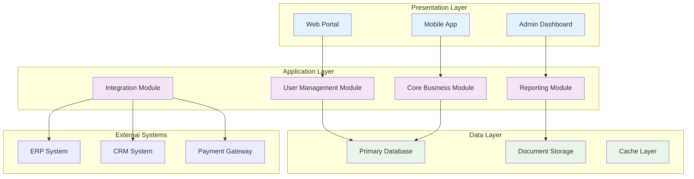
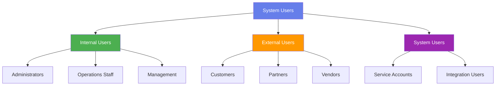
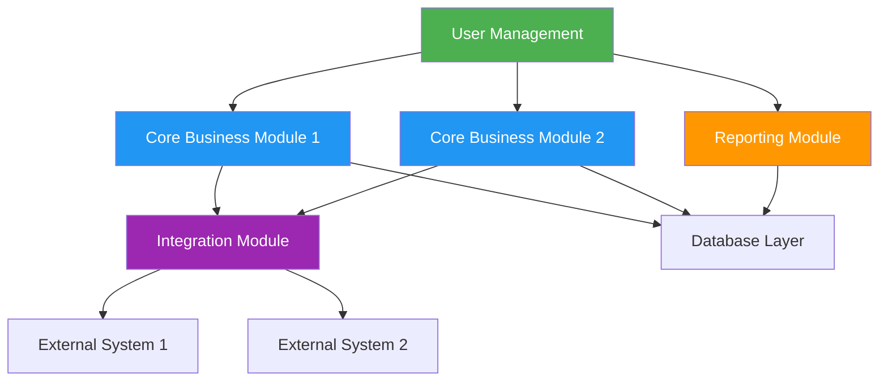
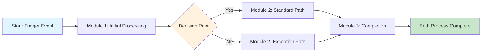
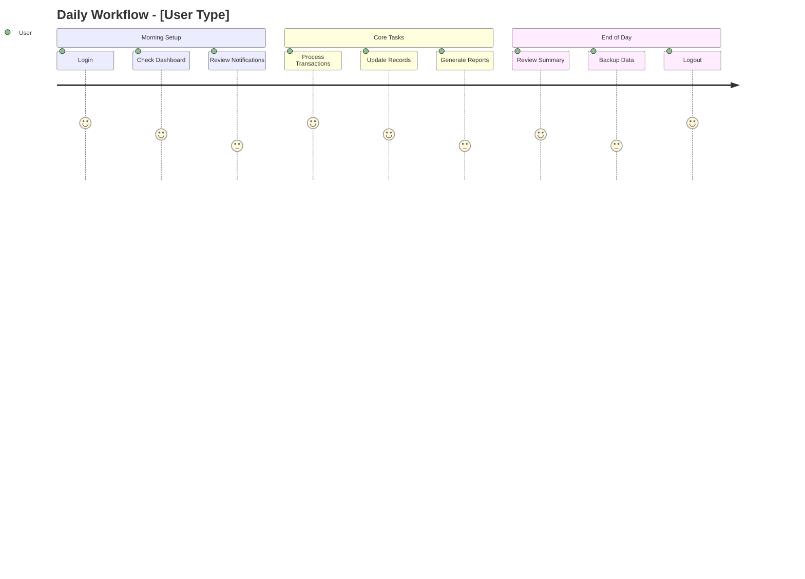
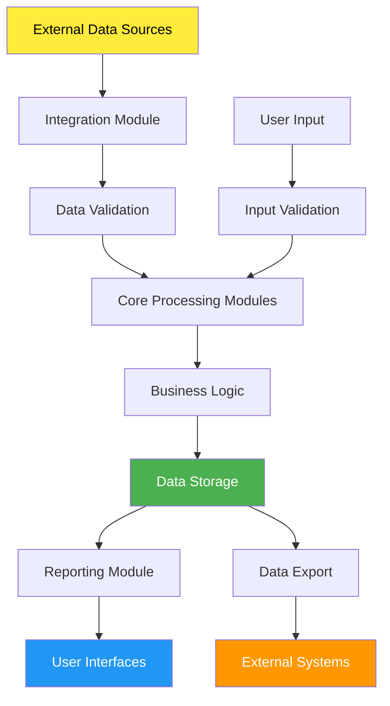

# System Modules and Processes Summary

## Document Information
- **System Name:** [System/Application Name]
- **System Version:** [Version Number]
- **Document Version:** 1.0
- **Date:** [Current Date]
- **Prepared By:** [Author Name, Role]
- **Reviewed By:** [Reviewer Name, Role]
- **Approved By:** [Approver Name, Role]
- **Document Type:** System Overview
- **Classification:** [Internal | Confidential | Public]

## Document History
| Version | Date | Author | Changes | Reviewer |
|---------|------|--------|---------|----------|
| 1.0 | [Date] | [Author] | Initial version | [Reviewer] |

---

## 1. Executive Summary

### 1.1 System Overview
[Brief description of the system, its primary purpose, and business value]

### 1.2 Key Statistics
| Metric | Value | Notes |
|--------|-------|-------|
| **Total Modules** | [Number] | [Active/Deployed modules] |
| **Total Users** | [Number] | [Active user count] |
| **User Types** | [Number] | [Different user roles] |
| **Business Processes** | [Number] | [Core processes supported] |
| **Daily Transactions** | [Number] | [Average daily volume] |
| **System Uptime** | [Percentage] | [Availability metric] |

### 1.3 System Scope
- **Business Domain:** [Primary business area served]
- **Geographic Coverage:** [Regional/Global scope]
- **Integration Points:** [Number of external systems integrated]
- **Deployment Model:** [On-premise/Cloud/Hybrid]

---

## 2. System Architecture Overview

### 2.1 High-Level Architecture

### 2.2 Technology Stack Summary
| Layer | Technology | Purpose |
|-------|------------|---------|
| **Frontend** | [Technology] | User interface and experience |
| **Backend** | [Technology] | Business logic and APIs |
| **Database** | [Technology] | Data persistence and management |
| **Infrastructure** | [Technology] | Hosting and deployment |
| **Integration** | [Technology] | External system connectivity |

---

## 3. System Users and Roles

### 3.1 User Classification

### 3.2 User Roles Matrix
| Role | User Type | Access Level | Primary Functions | Module Access | User Count |
|------|-----------|--------------|-------------------|---------------|------------|
| **System Administrator** | Internal | Full | System configuration, user management | All modules | [Number] |
| **Business Administrator** | Internal | High | Business rules, process management | [Specific modules] | [Number] |
| **Operations Manager** | Internal | Medium | Daily operations, monitoring | [Specific modules] | [Number] |
| **End User** | Internal | Standard | Daily business tasks | [Specific modules] | [Number] |
| **Customer** | External | Limited | Self-service functions | [Customer modules] | [Number] |
| **Partner** | External | Restricted | Collaboration functions | [Partner modules] | [Number] |
| **API User** | System | Programmatic | Automated processes | [API endpoints] | [Number] |

### 3.3 User Access Patterns
| User Type | Peak Usage Times | Common Activities | Access Channels |
|-----------|------------------|-------------------|-----------------|
| **Internal Users** | [Time periods] | [Primary activities] | [Web portal, mobile] |
| **External Users** | [Time periods] | [Primary activities] | [Customer portal, API] |
| **System Users** | [Time periods] | [Automated processes] | [API, batch jobs] |

---

## 4. System Modules

### 4.1 Module Overview
| Module ID | Module Name | Purpose | Status | Dependencies | Owner |
|-----------|-------------|---------|--------|--------------|-------|
| MOD-001 | [Module Name] | [Primary function] | [Active/Inactive] | [Dependencies] | [Team/Owner] |
| MOD-002 | [Module Name] | [Primary function] | [Active/Inactive] | [Dependencies] | [Team/Owner] |
| MOD-003 | [Module Name] | [Primary function] | [Active/Inactive] | [Dependencies] | [Team/Owner] |

### 4.2 Core Business Modules

#### 4.2.1 [Module Name 1]
- **Module ID:** MOD-001
- **Purpose:** [What this module does]
- **Key Features:**
  - [Feature 1]
  - [Feature 2]
  - [Feature 3]
- **Primary Users:** [User roles that use this module]
- **Business Value:** [How it supports business objectives]
- **Integration Points:** [Connected systems/modules]
- **Performance Metrics:**
  - [Metric 1]: [Value]
  - [Metric 2]: [Value]

#### 4.2.2 [Module Name 2]
- **Module ID:** MOD-002
- **Purpose:** [What this module does]
- **Key Features:**
  - [Feature 1]
  - [Feature 2]
  - [Feature 3]
- **Primary Users:** [User roles that use this module]
- **Business Value:** [How it supports business objectives]
- **Integration Points:** [Connected systems/modules]
- **Data Flow:** [How data moves in/out]

### 4.3 Supporting Modules

#### 4.3.1 User Management Module
- **Purpose:** Authentication, authorization, user lifecycle management
- **Key Functions:**
  - User registration and onboarding
  - Role-based access control
  - Password management
  - User profile management
- **Users:** All system users
- **Critical Dependencies:** [Authentication services, directory services]

#### 4.3.2 Reporting Module
- **Purpose:** Business intelligence and operational reporting
- **Key Functions:**
  - Standard report generation
  - Custom report builder
  - Dashboard creation
  - Data export capabilities
- **Users:** Management, operations staff, business analysts
- **Data Sources:** [Primary modules and external systems]

#### 4.3.3 Integration Module
- **Purpose:** External system connectivity and data exchange
- **Key Functions:**
  - API management
  - Data transformation
  - Error handling and retry logic
  - Integration monitoring
- **Users:** System administrators, integration specialists
- **External Connections:** [List of integrated systems]

### 4.4 Module Dependencies Map

---

## 5. Business Processes

### 5.1 Process Overview
| Process ID | Process Name | Type | Frequency | Modules Involved | Primary Users |
|------------|--------------|------|-----------|------------------|---------------|
| BP-001 | [Process Name] | [Core/Support] | [Daily/Weekly] | [Module list] | [User roles] |
| BP-002 | [Process Name] | [Core/Support] | [Daily/Weekly] | [Module list] | [User roles] |
| BP-003 | [Process Name] | [Core/Support] | [Daily/Weekly] | [Module list] | [User roles] |

### 5.2 Core Business Processes

#### 5.2.1 [Process Name 1]
- **Process ID:** BP-001
- **Description:** [What this process accomplishes]
- **Business Objective:** [Why this process exists]
- **Frequency:** [How often it runs]
- **Trigger:** [What initiates the process]

**Process Flow:**

**Stakeholders:**
- **Process Owner:** [Role/Person]
- **Primary Users:** [User roles involved]
- **Approvers:** [Who approves/reviews]
- **Beneficiaries:** [Who benefits from output]

**Key Metrics:**
- **Processing Time:** [Average time]
- **Success Rate:** [Percentage]
- **Volume:** [Transactions per period]
- **Error Rate:** [Percentage]

#### 5.2.2 [Process Name 2]
- **Process ID:** BP-002
- **Description:** [What this process accomplishes]
- **Business Objective:** [Why this process exists]
- **Frequency:** [How often it runs]

**Module Interaction:**
| Step | Module | User Role | Action | Duration |
|------|--------|-----------|--------|----------|
| 1 | [Module A] | [Role] | [Action description] | [Time] |
| 2 | [Module B] | [Role] | [Action description] | [Time] |
| 3 | [Module C] | [Role] | [Action description] | [Time] |

**Integration Points:**
- **External System 1:** [How it integrates]
- **External System 2:** [How it integrates]

### 5.3 Supporting Processes

#### 5.3.1 User Onboarding Process
- **Purpose:** New user account creation and initial access setup
- **Modules Involved:** User Management, Security, Notification
- **Users:** HR, IT Administration, New Users
- **Duration:** [Time to complete]
- **Automation Level:** [Manual/Semi-automated/Automated]

#### 5.3.2 Data Backup Process
- **Purpose:** Regular system data backup and recovery preparation
- **Modules Involved:** All data-generating modules
- **Users:** System Administrators, DBAs
- **Frequency:** [Daily/Weekly schedule]
- **Recovery Time:** [RTO/RPO metrics]

### 5.4 Process Integration Matrix
| Process | Modules Used | External Systems | User Roles | Dependencies |
|---------|--------------|------------------|------------|--------------|
| [Process 1] | [Module list] | [System list] | [Role list] | [Dependency list] |
| [Process 2] | [Module list] | [System list] | [Role list] | [Dependency list] |

---

## 6. User Journey Mapping

### 6.1 Typical User Journeys

#### 6.1.1 [User Type] Daily Workflow

#### 6.1.2 Cross-Module User Flow
| Step | Module | User Action | System Response | Next Module |
|------|--------|-------------|-----------------|-------------|
| 1 | [Module A] | [User action] | [System response] | [Next module] |
| 2 | [Module B] | [User action] | [System response] | [Next module] |
| 3 | [Module C] | [User action] | [System response] | [Complete] |

### 6.2 User Experience Metrics
| User Type | Login Frequency | Session Duration | Most Used Modules | Satisfaction Score |
|-----------|----------------|------------------|-------------------|-------------------|
| [User Type 1] | [Frequency] | [Duration] | [Module list] | [Score/10] |
| [User Type 2] | [Frequency] | [Duration] | [Module list] | [Score/10] |

---

## 7. Data Flow and Integration

### 7.1 System Data Flow

### 7.2 Integration Summary
| Integration Type | External System | Data Direction | Frequency | Module Responsible |
|------------------|-----------------|----------------|-----------|-------------------|
| [API/File/DB] | [System name] | [In/Out/Both] | [Real-time/Batch] | [Module name] |
| [API/File/DB] | [System name] | [In/Out/Both] | [Real-time/Batch] | [Module name] |

### 7.3 Data Governance
| Data Type | Owner | Classification | Retention Policy | Access Control |
|-----------|-------|----------------|------------------|----------------|
| [Data type] | [Owner role] | [Public/Internal/Confidential] | [Retention period] | [Access rules] |
| [Data type] | [Owner role] | [Public/Internal/Confidential] | [Retention period] | [Access rules] |

---

## 8. Performance and Monitoring

### 8.1 System Performance Metrics
| Metric | Current Value | Target | Trend | Monitoring Tool |
|--------|---------------|--------|-------|-----------------|
| **Response Time** | [Value] | [Target] | [↑↓→] | [Tool name] |
| **Throughput** | [Value] | [Target] | [↑↓→] | [Tool name] |
| **Availability** | [Value] | [Target] | [↑↓→] | [Tool name] |
| **Error Rate** | [Value] | [Target] | [↑↓→] | [Tool name] |

### 8.2 Module Performance
| Module | Users | Transactions/Day | Response Time | Error Rate | Resource Usage |
|--------|-------|------------------|---------------|------------|----------------|
| [Module 1] | [Count] | [Volume] | [Time] | [%] | [CPU/Memory] |
| [Module 2] | [Count] | [Volume] | [Time] | [%] | [CPU/Memory] |

### 8.3 User Activity Metrics
| User Type | Active Users | Peak Concurrent | Average Session | Most Used Feature |
|-----------|--------------|-----------------|-----------------|-------------------|
| [Type 1] | [Count] | [Count] | [Duration] | [Feature] |
| [Type 2] | [Count] | [Count] | [Duration] | [Feature] |

---

## 9. Security and Compliance

### 9.1 Security Framework
| Security Layer | Implementation | Modules Covered | Compliance Standard |
|----------------|----------------|------------------|-------------------|
| **Authentication** | [Method] | All modules | [Standard] |
| **Authorization** | [Method] | All modules | [Standard] |
| **Data Encryption** | [Method] | [Sensitive modules] | [Standard] |
| **Audit Logging** | [Method] | All modules | [Standard] |

### 9.2 User Access Security
| User Type | Authentication Method | Access Restrictions | Session Timeout | Audit Level |
|-----------|----------------------|-------------------|-----------------|-------------|
| [Internal Users] | [Method] | [Restrictions] | [Timeout] | [Level] |
| [External Users] | [Method] | [Restrictions] | [Timeout] | [Level] |

### 9.3 Compliance Requirements
| Requirement | Applicable Modules | Implementation | Audit Frequency |
|-------------|-------------------|----------------|-----------------|
| [Regulation 1] | [Module list] | [How implemented] | [Frequency] |
| [Regulation 2] | [Module list] | [How implemented] | [Frequency] |

---

## 10. Maintenance and Support

### 10.1 Module Maintenance Schedule
| Module | Maintenance Type | Frequency | Downtime | Responsible Team |
|--------|------------------|-----------|----------|------------------|
| [Module 1] | [Type] | [Frequency] | [Duration] | [Team] |
| [Module 2] | [Type] | [Frequency] | [Duration] | [Team] |

### 10.2 Support Structure
| Support Level | Response Time | Availability | Contact Method | Escalation Path |
|---------------|---------------|--------------|----------------|-----------------|
| **Level 1** | [Time] | [Hours] | [Method] | [Next level] |
| **Level 2** | [Time] | [Hours] | [Method] | [Next level] |
| **Level 3** | [Time] | [Hours] | [Method] | [Management] |

### 10.3 Change Management
- **Change Request Process:** [How changes are requested and approved]
- **Release Schedule:** [Regular release cycle]
- **Testing Requirements:** [Testing standards before deployment]
- **Rollback Procedures:** [How to revert changes if needed]

---

## 11. Future Roadmap

### 11.1 Planned Enhancements
| Enhancement | Target Module | Expected Benefit | Timeline | Priority |
|-------------|---------------|------------------|----------|----------|
| [Enhancement 1] | [Module] | [Benefit] | [Timeline] | [High/Medium/Low] |
| [Enhancement 2] | [Module] | [Benefit] | [Timeline] | [High/Medium/Low] |

### 11.2 Technology Upgrades
| Component | Current Version | Target Version | Upgrade Reason | Impact |
|-----------|----------------|----------------|----------------|--------|
| [Technology] | [Version] | [Version] | [Reason] | [Impact description] |

### 11.3 Capacity Planning
| Resource | Current Capacity | Projected Need | Timeline | Action Required |
|----------|------------------|----------------|----------|-----------------|
| [Resource type] | [Current] | [Projected] | [When] | [Action] |

---

## 12. Appendices

### Appendix A: Module Detailed Specifications
[Links to detailed technical specifications for each module]

### Appendix B: User Role Definitions
[Detailed role descriptions and responsibilities]

### Appendix C: Process Documentation
[Links to detailed process documentation]

### Appendix D: Integration Specifications
[Technical details of system integrations]

### Appendix E: Emergency Procedures
[System emergency response and recovery procedures]

### Appendix F: Contact Directory
| Role | Name | Email | Phone | Backup Contact |
|------|------|-------|-------|----------------|
| System Owner | [Name] | [Email] | [Phone] | [Backup] |
| Technical Lead | [Name] | [Email] | [Phone] | [Backup] |
| Business Lead | [Name] | [Email] | [Phone] | [Backup] |

---

## Document Approval

| Role | Name | Signature | Date |
|------|------|-----------|------|
| **System Owner** | [Name] | [Signature] | [Date] |
| **Technical Lead** | [Name] | [Signature] | [Date] |
| **Business Stakeholder** | [Name] | [Signature] | [Date] |
| **Security Officer** | [Name] | [Signature] | [Date] |

---

*This document contains confidential and proprietary information. Distribution is restricted to authorized personnel only.*

**Next Review Date:** [Date]
**Document Location:** [Repository/URL]
**Related Documents:** [List of related documentation]