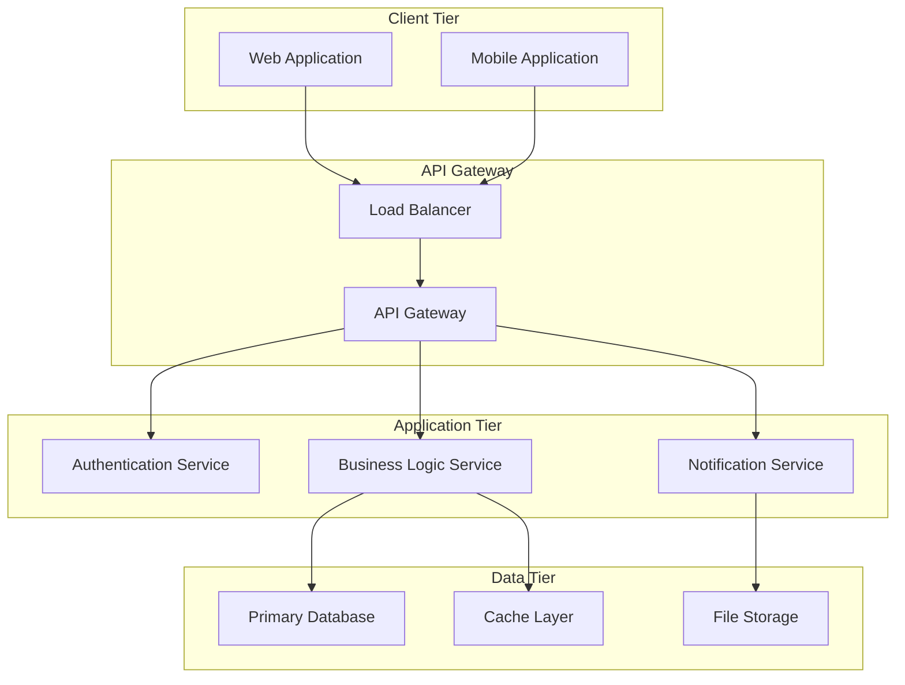
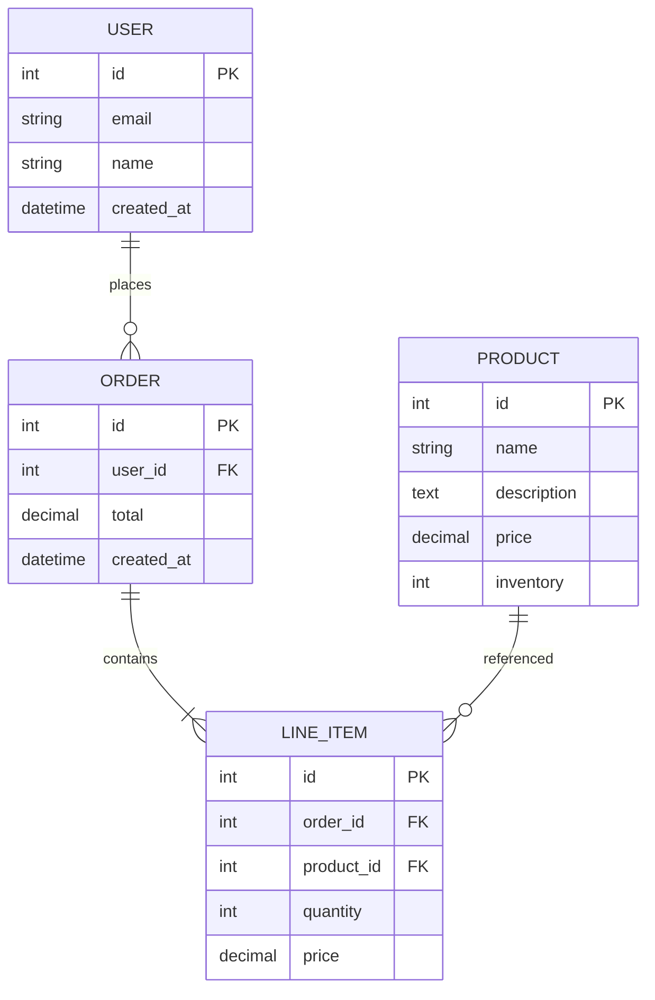

# Technical Specification Document

## Document Information
- **Document Title:** [Project Name] Technical Specification
- **Version:** 1.0
- **Date:** [Current Date]
- **Author(s):** [Name(s), Role(s)]
- **Reviewers:** [Name(s), Role(s)]
- **Approvers:** [Name(s), Role(s)]
- **Status:** [Draft | Review | Approved | Final]

## Document History
| Version | Date | Author | Changes |
|---------|------|--------|---------|
| 1.0 | [Date] | [Author] | Initial version |

---

## 1. Executive Summary

### 1.1 Project Overview
[Brief description of the project, its purpose, and high-level goals]

### 1.2 Scope
[What is included and excluded from this technical specification]

### 1.3 Key Stakeholders
| Role | Name | Responsibility |
|------|------|---------------|
| Product Owner | [Name] | [Responsibility] |
| Technical Lead | [Name] | [Responsibility] |
| Solution Architect | [Name] | [Responsibility] |

---

## 2. Business Requirements Summary

### 2.1 Business Objectives
- [Objective 1]
- [Objective 2]
- [Objective 3]

### 2.2 Success Criteria
- [Criteria 1 with measurable metrics]
- [Criteria 2 with measurable metrics]
- [Criteria 3 with measurable metrics]

### 2.3 Constraints
- **Time Constraints:** [Timeline limitations]
- **Budget Constraints:** [Budget limitations]
- **Resource Constraints:** [Personnel/technology limitations]
- **Regulatory Constraints:** [Compliance requirements]

---

## 3. System Architecture

### 3.1 High-Level Architecture
[Describe the overall system architecture with diagrams]



### 3.2 Component Overview
| Component | Purpose | Technology | Dependencies |
|-----------|---------|------------|--------------|
| [Component 1] | [Purpose] | [Technology Stack] | [Dependencies] |
| [Component 2] | [Purpose] | [Technology Stack] | [Dependencies] |

### 3.3 Integration Points
- **External APIs:** [List external services and APIs]
- **Third-party Services:** [Authentication, payment, etc.]
- **Legacy Systems:** [Existing system integrations]

---

## 4. Technical Requirements

### 4.1 Functional Requirements

#### 4.1.1 Core Features
| Feature ID | Feature Name | Description | Priority | Acceptance Criteria |
|------------|--------------|-------------|----------|-------------------|
| F001 | [Feature Name] | [Description] | High | [Criteria] |
| F002 | [Feature Name] | [Description] | Medium | [Criteria] |

#### 4.1.2 User Management
- **Authentication:** [Method and requirements]
- **Authorization:** [Role-based access control]
- **User Profiles:** [Profile management features]

#### 4.1.3 Data Management
- **Data Entry:** [Input validation and processing]
- **Data Retrieval:** [Search and filtering capabilities]
- **Data Export:** [Export formats and methods]

### 4.2 Non-Functional Requirements

#### 4.2.1 Performance Requirements
- **Response Time:** [Maximum acceptable response times]
- **Throughput:** [Transactions per second/minute]
- **Concurrent Users:** [Maximum supported concurrent users]
- **Data Volume:** [Expected data growth and storage requirements]

#### 4.2.2 Scalability Requirements
- **Horizontal Scaling:** [Auto-scaling requirements]
- **Vertical Scaling:** [Resource scaling parameters]
- **Load Distribution:** [Load balancing strategy]

#### 4.2.3 Availability Requirements
- **Uptime:** [Required availability percentage]
- **Recovery Time:** [Maximum downtime acceptable]
- **Disaster Recovery:** [Backup and recovery procedures]

#### 4.2.4 Security Requirements
- **Authentication:** [Security protocols and standards]
- **Data Encryption:** [In-transit and at-rest encryption]
- **Access Control:** [Permission models and restrictions]
- **Compliance:** [Regulatory compliance requirements]

---

## 5. Technology Stack

### 5.1 Frontend Technologies
| Component | Technology | Version | Justification |
|-----------|------------|---------|---------------|
| Framework | [React/Vue/Angular] | [Version] | [Why chosen] |
| State Management | [Redux/Vuex/NgRx] | [Version] | [Why chosen] |
| UI Library | [Material-UI/Ant Design] | [Version] | [Why chosen] |
| Build Tool | [Webpack/Vite] | [Version] | [Why chosen] |

### 5.2 Backend Technologies
| Component | Technology | Version | Justification |
|-----------|------------|---------|---------------|
| Runtime | [Node.js/Python/Java] | [Version] | [Why chosen] |
| Framework | [Express/Django/Spring] | [Version] | [Why chosen] |
| ORM/ODM | [Prisma/Mongoose/Hibernate] | [Version] | [Why chosen] |
| API Style | [REST/GraphQL] | [Version] | [Why chosen] |

### 5.3 Database Technologies
| Component | Technology | Version | Justification |
|-----------|------------|---------|---------------|
| Primary DB | [PostgreSQL/MongoDB] | [Version] | [Why chosen] |
| Cache | [Redis/Memcached] | [Version] | [Why chosen] |
| Search | [Elasticsearch/Algolia] | [Version] | [Why chosen] |

### 5.4 Infrastructure & DevOps
| Component | Technology | Version | Justification |
|-----------|------------|---------|---------------|
| Cloud Provider | [AWS/Azure/GCP] | [Version] | [Why chosen] |
| Containerization | [Docker/Kubernetes] | [Version] | [Why chosen] |
| CI/CD | [GitHub Actions/Jenkins] | [Version] | [Why chosen] |
| Monitoring | [DataDog/New Relic] | [Version] | [Why chosen] |

---

## 6. Data Architecture

### 6.1 Data Model
[Describe the overall data structure and relationships]



### 6.2 Database Schema

#### 6.2.1 Core Tables
| Table Name | Purpose | Key Fields | Relationships |
|------------|---------|------------|---------------|
| users | User account information | id, email, name | One-to-many with orders |
| orders | Order transactions | id, user_id, total | Many-to-one with users |

#### 6.2.2 Data Storage Strategy
- **Primary Data:** [Storage approach for transactional data]
- **Analytics Data:** [Strategy for reporting and analytics]
- **File Storage:** [Approach for documents and media]
- **Backup Strategy:** [Backup frequency and retention]

### 6.3 Data Flow
[Describe how data moves through the system]

---

## 7. API Specification

### 7.1 API Design Principles
- **RESTful Design:** [REST principles followed]
- **Versioning Strategy:** [How APIs will be versioned]
- **Error Handling:** [Standard error response format]
- **Rate Limiting:** [Request limiting strategy]

### 7.2 Core Endpoints

#### 7.2.1 Authentication Endpoints
```
POST /api/v1/auth/login
POST /api/v1/auth/logout
POST /api/v1/auth/refresh
```

#### 7.2.2 User Management Endpoints
```
GET    /api/v1/users
POST   /api/v1/users
GET    /api/v1/users/{id}
PUT    /api/v1/users/{id}
DELETE /api/v1/users/{id}
```

### 7.3 Request/Response Examples

#### Example: Create User
**Request:**
```json
POST /api/v1/users
Content-Type: application/json

{
  "name": "John Doe",
  "email": "john.doe@example.com",
  "role": "user"
}
```

**Response:**
```json
HTTP/1.1 201 Created
Content-Type: application/json

{
  "id": 123,
  "name": "John Doe",
  "email": "john.doe@example.com",
  "role": "user",
  "created_at": "2024-01-15T10:30:00Z"
}
```

---

## 8. Security Architecture

### 8.1 Authentication & Authorization
- **Authentication Method:** [JWT/OAuth/SAML]
- **Session Management:** [How sessions are handled]
- **Role-Based Access:** [Permission matrix]

### 8.2 Data Protection
- **Encryption in Transit:** [TLS/SSL configuration]
- **Encryption at Rest:** [Database encryption strategy]
- **PII Handling:** [Personal data protection measures]

### 8.3 Security Controls
| Control Type | Implementation | Monitoring |
|--------------|----------------|------------|
| Input Validation | [Validation strategy] | [How monitored] |
| SQL Injection | [Prevention methods] | [Detection methods] |
| CSRF Protection | [Protection mechanism] | [Validation process] |

---

## 9. Deployment Architecture

### 9.1 Environment Strategy
| Environment | Purpose | Configuration |
|-------------|---------|---------------|
| Development | Local development | [Config details] |
| Staging | Pre-production testing | [Config details] |
| Production | Live system | [Config details] |

### 9.2 Infrastructure Requirements

#### 9.2.1 Computing Resources
- **Application Servers:** [Specifications and scaling]
- **Database Servers:** [Specifications and replication]
- **Load Balancers:** [Configuration and failover]

#### 9.2.2 Network Requirements
- **Bandwidth:** [Expected traffic and capacity]
- **CDN:** [Content delivery strategy]
- **DNS:** [Domain and subdomain strategy]

### 9.3 Monitoring & Logging
- **Application Monitoring:** [Performance metrics tracked]
- **Error Tracking:** [Error logging and alerting]
- **User Analytics:** [User behavior tracking]

---

## 10. Testing Strategy

### 10.1 Testing Levels
| Test Type | Coverage | Tools | Responsibility |
|-----------|----------|-------|---------------|
| Unit Tests | [Coverage %] | [Testing framework] | [Development team] |
| Integration Tests | [Scope] | [Testing tools] | [QA team] |
| End-to-End Tests | [User journeys] | [E2E framework] | [QA team] |
| Performance Tests | [Load scenarios] | [Load testing tools] | [DevOps team] |

### 10.2 Test Automation
- **Continuous Integration:** [CI pipeline testing]
- **Automated Deployment:** [Deployment testing strategy]
- **Regression Testing:** [Automated regression suite]

---

## 11. Migration Strategy

### 11.1 Data Migration
- **Migration Approach:** [Strategy for existing data]
- **Data Validation:** [Verification procedures]
- **Rollback Plan:** [Rollback procedures if needed]

### 11.2 Deployment Strategy
- **Blue-Green Deployment:** [Zero-downtime deployment]
- **Feature Flags:** [Gradual feature rollout]
- **Monitoring:** [Post-deployment monitoring]

---

## 12. Maintenance & Support

### 12.1 Operational Procedures
- **Backup Procedures:** [Automated backup strategy]
- **Monitoring Alerts:** [Alert thresholds and escalation]
- **Performance Tuning:** [Ongoing optimization procedures]

### 12.2 Support Strategy
- **Issue Tracking:** [Bug tracking and resolution process]
- **Documentation:** [User and technical documentation]
- **Knowledge Transfer:** [Team knowledge sharing]

---

## 13. Risk Assessment

### 13.1 Technical Risks
| Risk | Impact | Probability | Mitigation Strategy |
|------|--------|-------------|-------------------|
| [Risk 1] | High/Medium/Low | High/Medium/Low | [Mitigation approach] |
| [Risk 2] | High/Medium/Low | High/Medium/Low | [Mitigation approach] |

### 13.2 Operational Risks
| Risk | Impact | Probability | Mitigation Strategy |
|------|--------|-------------|-------------------|
| [Risk 1] | High/Medium/Low | High/Medium/Low | [Mitigation approach] |
| [Risk 2] | High/Medium/Low | High/Medium/Low | [Mitigation approach] |

---

## 14. Project Timeline

### 14.1 Development Phases
| Phase | Duration | Key Deliverables | Dependencies |
|-------|----------|------------------|--------------|
| Phase 1: Setup | [Duration] | [Deliverables] | [Dependencies] |
| Phase 2: Core Development | [Duration] | [Deliverables] | [Dependencies] |
| Phase 3: Integration | [Duration] | [Deliverables] | [Dependencies] |
| Phase 4: Testing | [Duration] | [Deliverables] | [Dependencies] |
| Phase 5: Deployment | [Duration] | [Deliverables] | [Dependencies] |

### 14.2 Critical Path
[Identify critical dependencies and potential bottlenecks]

---

## 15. Appendices

### Appendix A: Glossary
| Term | Definition |
|------|------------|
| [Term 1] | [Definition] |
| [Term 2] | [Definition] |

### Appendix B: References
- [Reference 1: Technical documentation]
- [Reference 2: Industry standards]
- [Reference 3: Best practices guides]

### Appendix C: Additional Diagrams
[Include detailed technical diagrams, wireframes, etc.]

---

## Document Approval

| Role | Name | Signature | Date |
|------|------|-----------|------|
| Technical Lead | [Name] | [Signature] | [Date] |
| Solution Architect | [Name] | [Signature] | [Date] |
| Product Owner | [Name] | [Signature] | [Date] |
| Security Lead | [Name] | [Signature] | [Date] |

---

*This document is confidential and proprietary to [Company Name]. Distribution is restricted to authorized personnel only.*